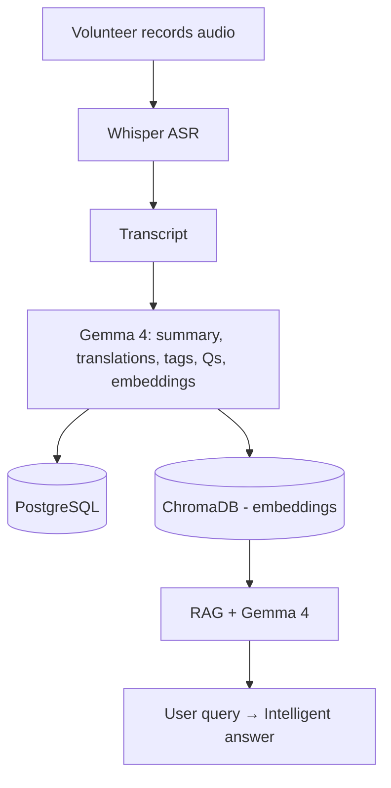

# LokKatha AI — India's Living Cultural Memory

## Problem

Much traditional and local knowledge in India is undocumented and at risk of being lost as older generations pass away. NGOs and volunteers often meet elders with valuable oral histories that are never recorded.

## Project Goal

Build a multilingual, AI-powered cultural preservation platform to:
- Record interviews with elders, artisans, farmers, and storytellers
- Convert speech to text (ASR)
- Translate transcripts into English, Bengali, and Hindi
- Generate summaries, titles, keywords, and cultural tags
- Create a searchable knowledge base with semantic search
- Enable question-answering over preserved stories using RAG + LLM

## Skills & Technologies

- Artificial Intelligence, ASR, LLMs (Gemma 4)
- Retrieval-Augmented Generation (RAG)
- Prompt engineering, embeddings, semantic search
- Python, FastAPI, Streamlit (or React)
- Whisper, LangChain, ChromaDB, PostgreSQL
- Google GenAI SDK (Gemma) or compatible LLM APIs

## System Architecture



## Quick Start

1. Create and activate a Python virtual environment

```bash
python -m venv .venv
.venv\Scripts\activate        # Windows
source .venv/bin/activate     # macOS / Linux
```

2. Install core dependencies

```bash
pip install -r requirements.txt
```

3. Record or upload an interview (save as `interview.wav`) and run ASR

```python
# example (placeholder)
from whisper_service import transcribe
transcript = transcribe('interview.wav')
```

4. Process transcript with Gemma 4 (or your LLM) to extract metadata and embeddings

5. Store metadata in PostgreSQL and embeddings in ChromaDB

6. Run the API

```bash
uvicorn app:app --reload
```

## Pipeline Steps

1. Record interview audio (volunteer or field worker)
2. Run Whisper ASR to transcribe speech to text
3. Send transcript to Gemma 4 with a prompt to generate:
   - Title, Summary
   - Translations (EN, BN, HI)
   - Cultural tags and keywords
   - Suggested questions and historical context
   - Embedding vector for semantic search
4. Save interview metadata and transcripts to PostgreSQL; save embeddings in ChromaDB
5. Use RAG (retrieve relevant records via vector search) + Gemma 4 to answer user queries

## Example Prompt (for Gemma 4)

You are an Indian cultural historian. Given the transcript, generate a JSON object with:

1. `title`
2. `summary`
3. `translations` (english, bengali, hindi)
4. `cultural_tags` (array)
5. `keywords` (array)
6. `suggested_questions` (array)
7. `historical_importance` (string)
8. `embedding` (vector)

## Error Handling

Handle common issues such as:
- Empty or corrupted audio
- Excessive background noise (preprocessing / denoising)
- Unsupported or low-resource languages
- LLM / API failures and rate limits
- Offline or intermittent connectivity

## Deployment Options

Deploy on platforms like Railway, Render, Hugging Face Spaces, or Google Cloud Run. Consider an offline-first mode for field use.

## Roadmap & Features

### Beginner
- Audio upload, speech-to-text, AI summary

### Intermediate
- Translation, cultural tagging, story search, AI Q&A

### Advanced
- Interactive heritage map, AI timeline generation, voice search, image understanding, offline LLM/Gemma, NGO analytics dashboard

## Project Structure

```text
lokkatha-ai/
├── app.py
├── whisper_service.py
├── gemma.py
├── embeddings.py
├── database.py
├── rag.py
├── interview.py
├── prompts/
├── uploads/
├── requirements.txt
└── README.md
```

## Mini Challenges / Enhancements

- Interactive heritage map
- Photo + story recognition
- Folk song identification
- Elder voice cloning (with informed consent)
- AI-generated children's storybooks from oral histories

## Interview Questions / FAQ

- Why use Whisper instead of directly using an LLM? Whisper is specialized for ASR and provides robust speech-to-text; LLMs are used for reasoning, summarization, and translation.
- What is Retrieval-Augmented Generation (RAG)? RAG retrieves relevant documents from a knowledge base (via embeddings) before composing an answer with an LLM.
- Why use a vector database? Vector DBs (e.g., ChromaDB) store embeddings to enable semantic search across transcripts and metadata.
- Why Gemma 4? Gemma 4 is the main target model for this project and helps with translation, summarization, tagging, and conversational QA over the archive.
- How does this create social impact? It preserves endangered oral traditions and local knowledge, making them accessible to communities and future generations.

## Notes

- This document is a cleaned and structured version of the project notes.
- For implementation, create `requirements.txt`, API keys, and secure storage for audio and personal data.
- Obtain informed consent before recording or cloning any voice.

## Master Project Documentation Suite

All detailed architecture, hackathon guides, pitch scripts, design specs, and FAQs are located in [`docs/`](docs/):

- 📋 [Product Requirements Document (PRD)](docs/PRD.md)
- 🔧 [Technical Requirements Document (TRD)](docs/TRD.md)
- 📚 [Theoretical Framework (THEORY)](docs/THEORY.md)
- 📘 [Complete Project Explanation](docs/PROJECT_EXPLANATION.md)
- 📊 [Slide-by-Slide PPT Master Guide](docs/PPT_STRUCTURE.md)
- 🎯 [Hackathon Pitch Deck](docs/PITCH_DECK.md)
- 🎬 [Second-by-Second Demo Script](docs/DEMO_SCRIPT.md)
- ❓ [160 Judges FAQ Master Playbook](docs/JUDGES_FAQ.md)
- 🎨 [UI/UX Design System & Traditional Aesthetics](docs/DESIGN_SYSTEM_UIUX.md)
- 💡 [Hackathon Strategy & Startup Mentor Playbook](docs/HACKATHON_STRATEGY_PLAYBOOK.md)

