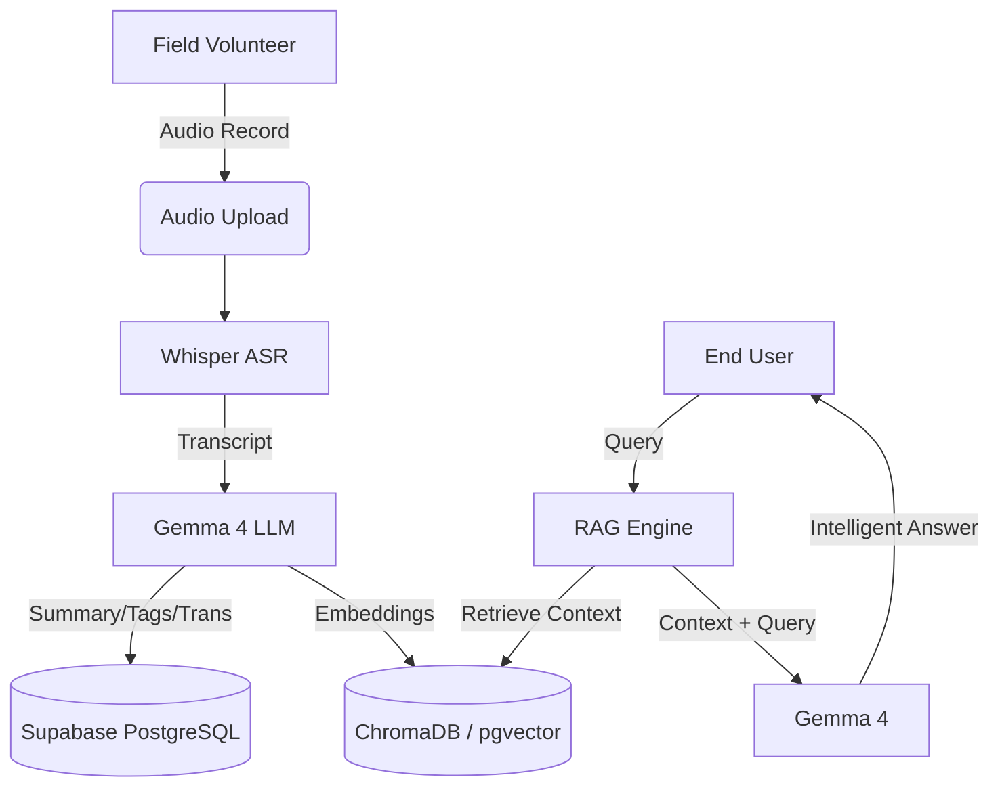
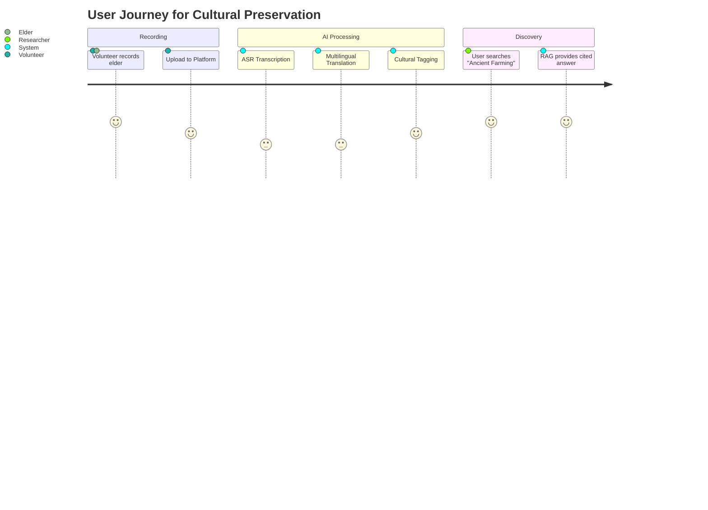
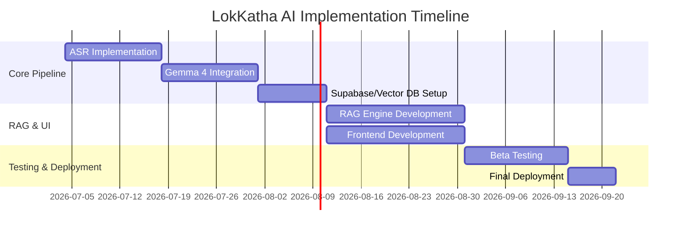

# LokKatha AI — India's Living Cultural Memory

## 🌟 Overview
LokKatha AI is a multilingual, AI-powered platform designed to preserve India's endangered oral traditions, folklore, and traditional knowledge. By combining SOTA ASR (Whisper) and LLMs (Gemma 4), it transforms raw audio interviews into a structured, searchable, and interactive cultural archive.

## 📂 Project Structure
```text
lokkatha-ai/
├── app.py                 # Main FastAPI application
├── whisper_service.py      # ASR pipeline (Speech-to-Text)
├── gemma.py               # LLM logic for translation/summarization
├── embeddings.py          # Vectorization logic
├── database.py            # PostgreSQL/Supabase connection
├── rag.py                 # Retrieval-Augmented Generation logic
├── interview.py           # Interview management
├── prompts/               # System prompts for Gemma 4
├── uploads/               # Raw audio storage
├── docs/                  # Project Documentation
│   ├── README.md          # General Overview
│   ├── PRD.md             # Product Requirements
│   ├── TRD.md             # Technical Requirements
│   ├── THEORY.md          # Theoretical Framework
│   └── USAGE_DEPLOYMENT.md # Setup and Deployment
├── requirements.txt       # Python dependencies
└── README.md              # Root guide
```

## 🛠 High-Level Architecture


## 🗺 User Journey


## 📈 Development Roadmap (Gantt)


## 🔗 Quick Links
- [Product Requirements (PRD)](docs/PRD.md)
- [Technical Requirements (TRD)](docs/TRD.md)
- [Theoretical Framework (THEORY)](docs/THEORY.md)
- [Usage & Deployment](docs/USAGE_DEPLOYMENT.md)
