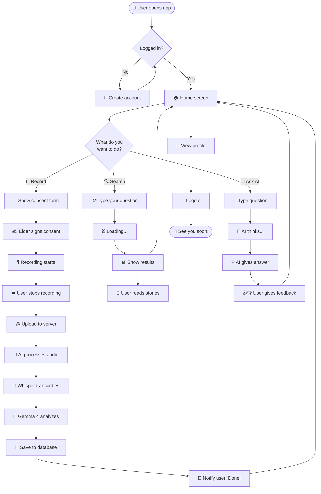
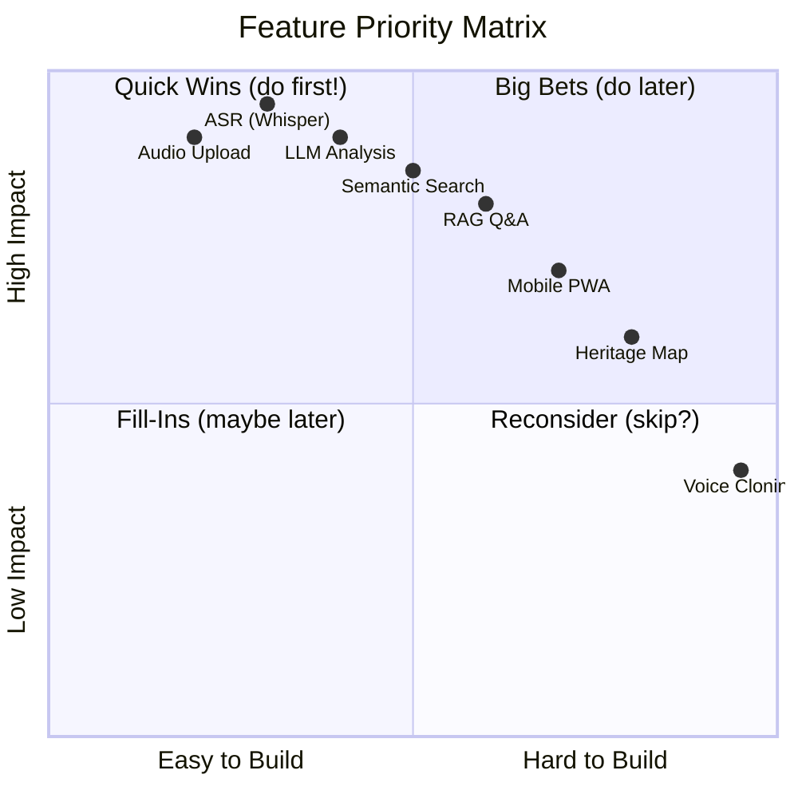
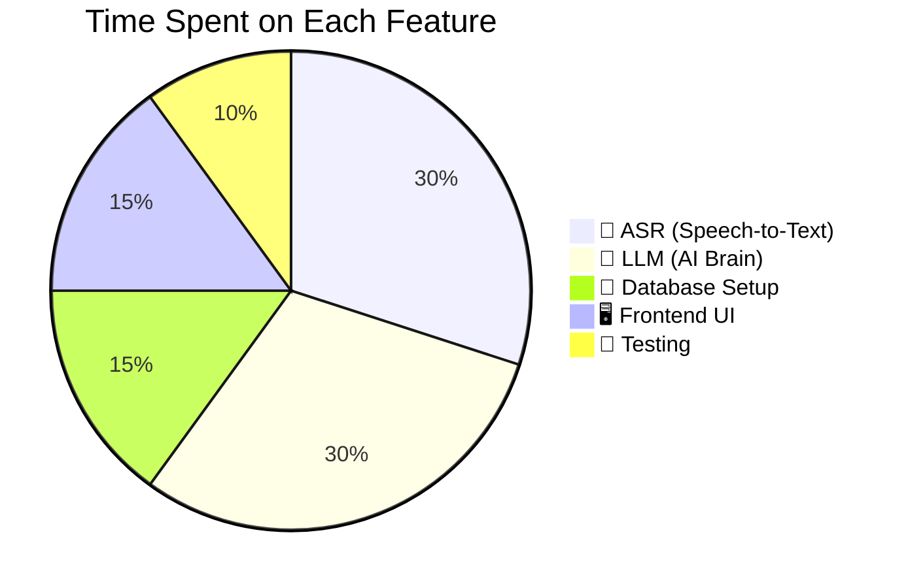
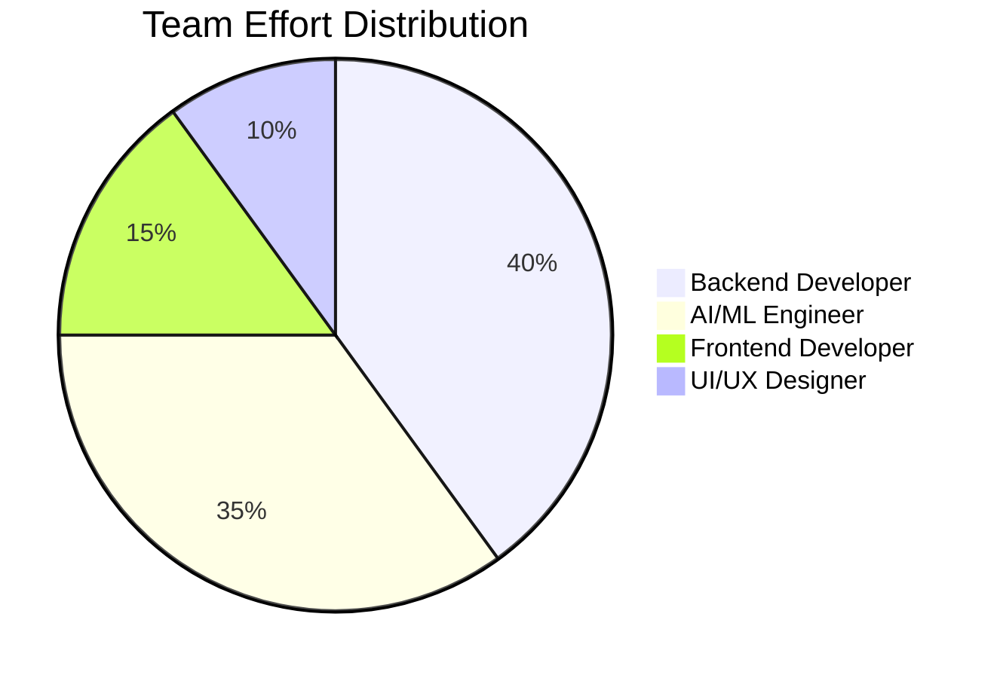

# 📋 Product Requirements Document (PRD)
## LokKatha AI — The Story Saver

> **Version:** 1.0 (Beginner-Friendly Edition)
> **Date:** July 2026
> **Reading Time:** ~25 minutes

---

## 📖 Table of Contents
1. [What is a PRD? (Simple Explanation)](#1-what-is-a-prd-simple-explanation)
2. [Product Vision (The Big Dream)](#2-product-vision-the-big-dream)
3. [Mission Statement (Why We Exist)](#3-mission-statement-why-we-exist)
4. [Target Audience (Who Will Use It)](#4-target-audience-who-will-use-it)
5. [User Personas (Made-Up Examples)](#5-user-personas-made-up-examples)
6. [Functional Requirements (What It Must Do)](#6-functional-requirements-what-it-must-do)
7. [Non-Functional Requirements (How Well It Must Do It)](#7-non-functional-requirements-how-well-it-must-do-it)
8. [Complete User Flow (Advanced Flowchart)](#8-complete-user-flow-advanced-flowchart)
9. [Project Kanban (What We're Doing)](#9-project-kanban-what-were-doing)
10. [Feature Priority Matrix (XY Chart)](#10-feature-priority-matrix-xy-chart)
11. [Distribution of Work (Pie Chart)](#11-distribution-of-work-pie-chart)
12. [Success Metrics (How We Measure Success)](#12-success-metrics-how-we-measure-success)
13. [Risks & How to Avoid Them](#13-risks--how-to-avoid-them)
14. [Future Roadmap (What's Next)](#14-future-roadmap-whats-next)
15. [Glossary](#15-glossary)

---

## 1. What is a PRD? (Simple Explanation)

A **PRD** (Product Requirements Document) is like a **shopping list** for building an app. Just like when you go to the market with a list of things to buy, a PRD tells the team:
- What to build 🛒
- Why to build it 🤔
- Who will use it 👥
- How good it needs to be ⭐

It answers the question: **"What should this app do?"**

---

## 2. Product Vision (The Big Dream)

### The One-Sentence Vision
> **"To preserve India's living oral heritage by transforming spoken stories into a multilingual, searchable, AI-powered cultural memory."**

### The Dream in Detail
Imagine a future where:
- 🧒 A child in Chennai can listen to a folk tale from a Kashmiri grandma
- 👩‍🔬 A historian can find all the stories about the 1947 Partition
- 👨‍🌾 A farmer can learn ancient monsoon techniques from elders across India
- 🌍 Anyone in the world can ask: *"What did India sound like 100 years ago?"* and get an answer

This is the future LokKatha AI is building. 🇮🇳

---

## 3. Mission Statement (Why We Exist)

**LokKatha AI exists to:**
1. **Save** oral traditions before they disappear
2. **Translate** regional knowledge into accessible languages
3. **Connect** generations through shared cultural memory
4. **Empower** communities to own and share their stories

### The Problem We Are Solving
- 300+ million Indians cannot read
- 22 official languages and 19,500+ dialects are at risk
- Indigenous knowledge (farming, medicine, crafts) is vanishing
- Younger generations are disconnected from their roots

---

## 4. Target Audience (Who Will Use It)

| Audience Type | % of Users | Why They Use It |
|---------------|-----------|-----------------|
| 👩‍🌾 **Field Volunteers** | 30% | Record and upload stories |
| 👵 **Elders (Storytellers)** | 25% | Share their life experiences |
| 👨‍🔬 **Researchers** | 20% | Study cultural patterns |
| 👩‍🏫 **Teachers** | 15% | Use stories in classrooms |
| 🧒 **General Public** | 10% | Learn about their culture |

---

## 5. User Personas (Made-Up Examples)

### 🧑‍🌾 Persona 1: Priya the Volunteer
- **Age:** 28
- **Location:** A village in West Bengal
- **Tech Skill:** Basic smartphone user
- **Goal:** Record her grandmother's stories about the 1960s
- **Pain Point:** Doesn't have time to type out long stories
- **How LokKatha Helps:** She just records audio, and the app does the rest!

### 👩‍🔬 Persona 2: Dr. Anjali the Researcher
- **Age:** 45
- **Location:** Delhi
- **Tech Skill:** Advanced computer user
- **Goal:** Find all folk songs about rivers in India
- **Pain Point:** Manually searching 10,000 audio files is impossible
- **How LokKatha Helps:** She searches "folk songs about rivers" and gets results in seconds!

### 🧒 Persona 3: Arjun the Curious Child
- **Age:** 12
- **Location:** Bangalore
- **Tech Skill:** Expert (knows YouTube better than parents!)
- **Goal:** Learn how kids in his village played 100 years ago
- **Pain Point:** All websites are in English, his family speaks Kannada
- **How LokKatha Helps:** He asks in Hindi or English, gets answers from real stories!

---

## 6. Functional Requirements (What It Must Do)

### FR1: Audio Recording & Upload
**Priority:** 🔴 Critical
- Users can record audio directly in the app
- Users can upload existing audio files (.mp3, .wav, .m4a)
- Maximum file size: 500 MB
- Audio is automatically compressed for storage

### FR2: Speech-to-Text (ASR)
**Priority:** 🔴 Critical
- Convert audio to text using Whisper AI
- Support at least: Hindi, Bengali, English (and ideally Tamil, Telugu, Marathi, Gujarati)
- Detect language automatically
- Return timestamps for each sentence

### FR3: AI Analysis (LLM)
**Priority:** 🔴 Critical
- Generate a short summary (3-5 sentences)
- Translate to English, Hindi, Bengali
- Add cultural tags (e.g., "farming", "festival", "wedding")
- Extract keywords
- Generate embedding vector for search

### FR4: Semantic Search
**Priority:** 🟠 High
- Search by meaning, not just keywords
- Cross-lingual: Search in English, find Hindi stories
- Filter by language, region, date, and tags
- Show snippet of matched text

### FR5: Q&A Chat (RAG)
**Priority:** 🟠 High
- Users can ask questions in natural language
- AI retrieves relevant stories
- AI generates an answer with citations
- Show source (which interview, which timestamp)

### FR6: Consent Management
**Priority:** 🔴 Critical
- Digital consent form before recording
- Audio recording of verbal consent
- Track who consented to what
- Allow withdrawal at any time
- Cascading deletion (remove from all databases)

### FR7: Offline Mode
**Priority:** 🟡 Medium
- Record audio without internet
- Queue uploads for later
- Basic search on local data
- Sync when internet is available

### FR8: Heritage Map
**Priority:** 🟢 Low (Future)
- Interactive map of India
- Click a region to see its stories
- Filter by type of story
- Visual timeline of recordings

---

## 7. Non-Functional Requirements (How Well It Must Do It)

| Metric | Target | Why It Matters |
|--------|--------|----------------|
| ⚡ **Speed** | Search results in <500ms | Users hate waiting |
| 🎯 **ASR Accuracy** | WER < 15% for Hindi/Bengali | Bad transcription = bad everything |
| 🌐 **Uptime** | 99.9% server availability | Researchers need access 24/7 |
| 🔒 **Security** | AES-256 encryption, TLS 1.3 | Stories are private and sensitive |
| 📱 **Mobile Friendly** | Works on low-end Android phones | Field volunteers use cheap phones |
| 🗣️ **Language Support** | 3+ Indian languages at launch | India is multilingual |
| 💾 **Scalability** | Support 1 million+ stories | This will grow over decades |

---

## 8. Complete User Flow (Advanced Flowchart)

This is the super-detailed flow of what happens when someone uses the app.



---

## 9. Project Kanban (What We're Doing)

```mermaid
kanban
  📋 Backlog (Coming Soon)
    - [ ] Build mobile PWA
    - [ ] Add voice cloning
    - [ ] Add Tamil, Telugu, Marathi
    - [ ] Add heritage map
    - [ ] Build NGO dashboard
  🚧 In Progress (Active)
    - [ ] Fine-tune Whisper for Indian languages
    - [ ] Design Gemma 4 prompts
    - [ ] Setup Supabase project
    - [ ] Build upload pipeline
    - [ ] Write API documentation
  👀 In Review (Being Checked)
    - [ ] Database schema design
    - [ ] Search algorithm
    - [ ] Frontend wireframes
  ✅ Done (Shipped!)
    - [x] Project idea finalized
    - [x] Research completed
    - [x] Tech stack chosen
    - [x] Documentation started
```

---

## 10. Feature Priority Matrix (XY Chart)

This shows which features are most important and which are easiest to build.



**Reading the chart:**
- **Top-Right (Quick Wins):** Do these first! They're important AND easy.
- **Top-Left (Big Bets):** Important but hard. Plan carefully.
- **Bottom-Right (Fill-Ins):** Not super important, but easy. Do if you have time.
- **Bottom-Left (Reconsider):** Low priority. Maybe skip.

---

## 11. Distribution of Work (Pie Chart)

### Effort Distribution by Feature


### Effort Distribution by Role


---

## 12. Success Metrics (How We Measure Success)

### Launch Goals (First 6 Months)
- ✅ 1,000+ stories recorded
- ✅ Support for 3+ languages
- ✅ 500+ active users
- ✅ 95%+ ASR accuracy on clear audio
- ✅ Average search time <500ms

### Long-Term Goals (1-2 Years)
- 🌍 100,000+ stories
- 🌍 10+ Indian languages
- 🌍 10,000+ active users
- 🌍 Partnership with 5+ NGOs
- 🌍 Featured in academic research

### How We Measure
| Metric | Tool | Frequency |
|--------|------|-----------|
| Stories recorded | Database count | Daily |
| User signups | Supabase Auth | Daily |
| Search speed | Application logs | Real-time |
| AI accuracy | Manual review | Weekly |
| User satisfaction | Surveys | Monthly |

---

## 13. Risks & How to Avoid Them

| Risk | Likelihood | Impact | Solution |
|------|-----------|--------|----------|
| 😰 Elders refuse to share | High | High | Build trust, offer anonymity, ensure benefit-sharing |
| 🤖 AI makes mistakes | High | Medium | Always cite sources, allow human review |
| 🌐 No internet in villages | High | High | Build offline mode |
| 💸 Costs too much | Medium | High | Use open-source models, free tiers of services |
| 🔐 Privacy breach | Low | Critical | Strong encryption, regular audits |
| 😕 Low adoption | Medium | High | Partner with NGOs, train volunteers |

---

## 14. Future Roadmap (What's Next)

### 🟢 Beginner (Months 1-3)
- Audio upload ✅
- Speech-to-text ✅
- AI summary ✅
- Basic search ✅

### 🟡 Intermediate (Months 4-6)
- Translation (3 languages) ✅
- Cultural tagging ✅
- RAG Q&A ✅
- User authentication ✅

### 🔴 Advanced (Months 7-12)
- Interactive heritage map 🗺️
- AI timeline generation 📅
- Voice search 🎙️
- Image understanding 📸
- Offline mode 📴
- NGO analytics dashboard 📊

### 🌟 Dream Features (Year 2+)
- Elder voice cloning (with consent) 🗣️
- AI-generated children's storybooks 📚
- Folk song identification 🎵
- Cross-cultural pattern analysis 🌍
- AR/VR heritage experiences 🥽

---

## 15. Glossary

| Term | Meaning |
|------|---------|
| **PRD** | Product Requirements Document - the shopping list for the app |
| **User Persona** | A made-up character that represents a type of user |
| **Functional Requirement** | Something the app must DO |
| **Non-Functional Requirement** | Something the app must do WELL (speed, security) |
| **MVP** | Minimum Viable Product - the simplest version that works |
| **KPI** | Key Performance Indicator - a way to measure success |
| **WER** | Word Error Rate - how many words the AI got wrong |
| **PWA** | Progressive Web App - a website that works like a mobile app |
| **RAG** | Retrieval-Augmented Generation - AI that looks things up |
| **ASR** | Automatic Speech Recognition - turning speech into text |

---

## 🎉 Conclusion

This PRD is a **living document**. It will grow and change as we learn more about our users and as the technology improves. We will update it:
- 📅 Every month with progress
- 🔄 After user feedback sessions
- 🚀 When we hit major milestones

**Next Steps:**
1. ✅ Share this PRD with the team
2. ✅ Get feedback from potential users
3. ✅ Start building the MVP (Minimum Viable Product)
4. ✅ Test with real elders and volunteers
5. ✅ Iterate based on what we learn

---

*Made with ❤️ for India's storytellers*
