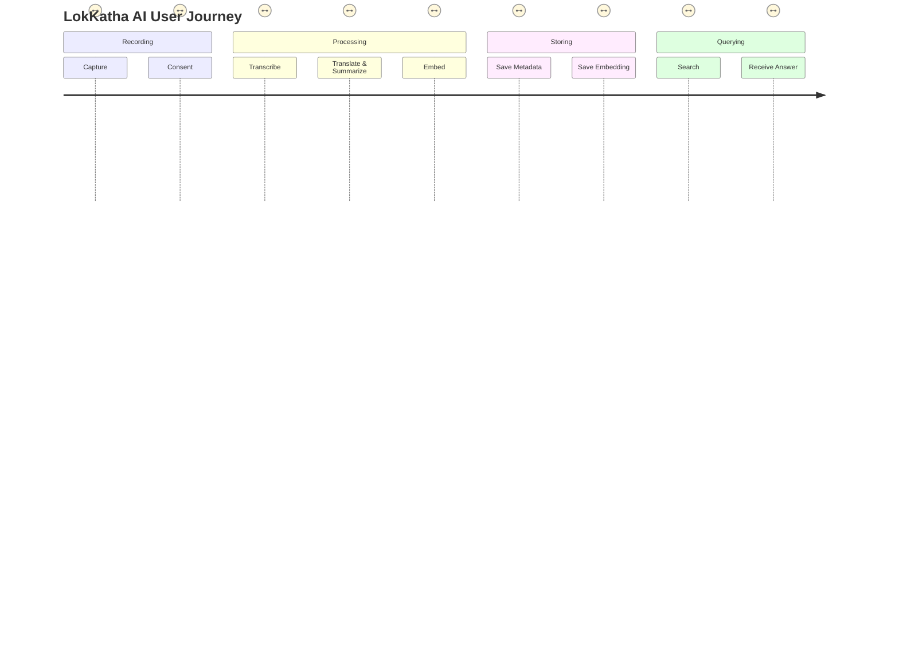
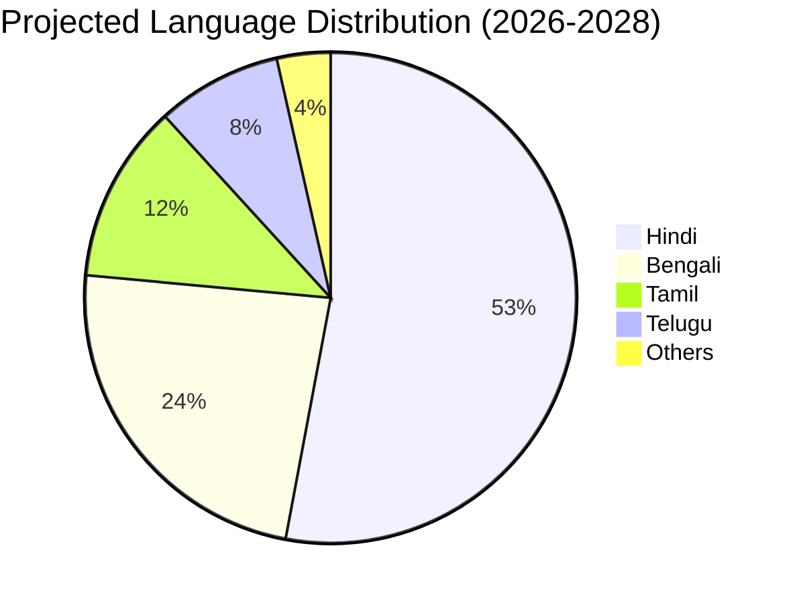
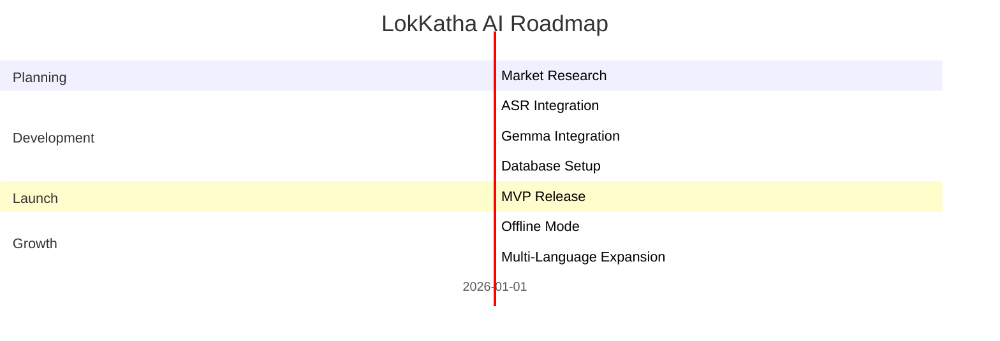

# Product Requirements Document (PRD) – LokKatha AI

## 1. Vision & Goals
Create a multilingual, AI‑powered platform that records, transcribes, translates, summarizes, and makes searchable India's oral cultural heritage.

## 2. Target Personas
- **Volunteer Fieldworker** – records interviews in rural areas.
- **Researcher** – queries the knowledge base for specific topics.
- **Educator** – uses content for classroom material.
- **Community Representative** – ensures ethical use and access.

## 3. User Journey

## 4. Feature Backlog (Kanban)

## 5. XY Chart – Language Usage Projection

## 6. Roadmap (High‑Level Timeline)

## 7. Success Metrics
- **Transactions per month** > 10,000
- **User satisfaction** > 4.5/5
- **Recordings archived** > 5,000 hrs within 12 months
- **Search accuracy** > 90% (precision@5)

## 8. Assumptions & Constraints
- Reliable internet for cloud deployment; offline mode planned for field use.
- Volunteers will complete consent forms before recording.
- Gemma 4 API quotas will be monitored to control cost.

## 9. Risks
- **Low WER for low‑resource dialects** – mitigated by fine‑tuning on regional datasets.
- **Ethical misuse of content** – mitigated by strict access controls and community oversight.