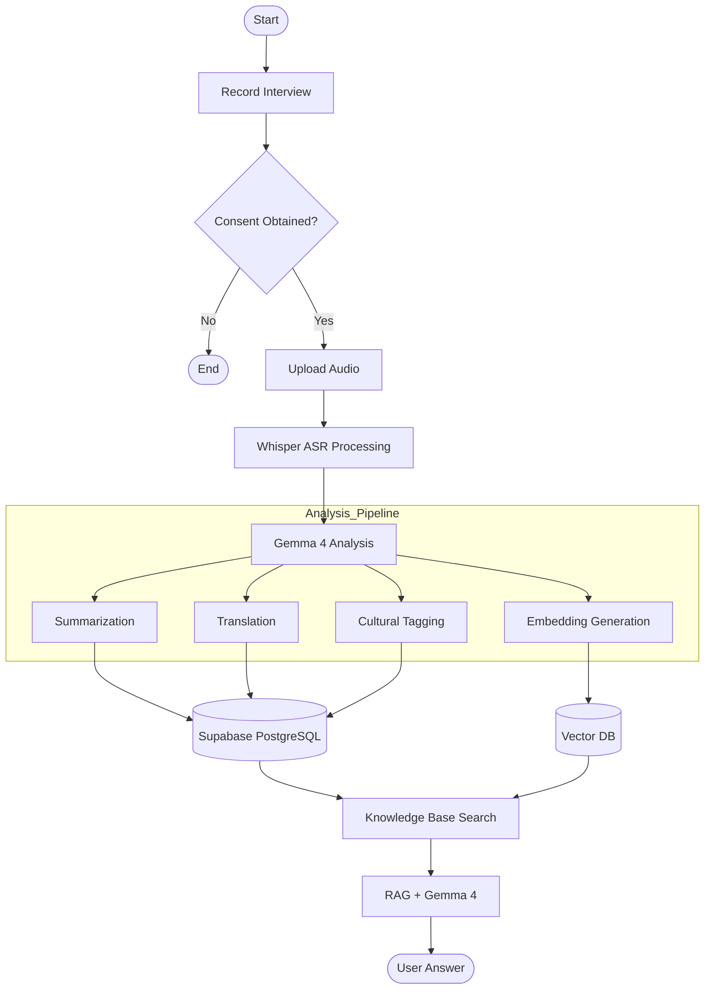
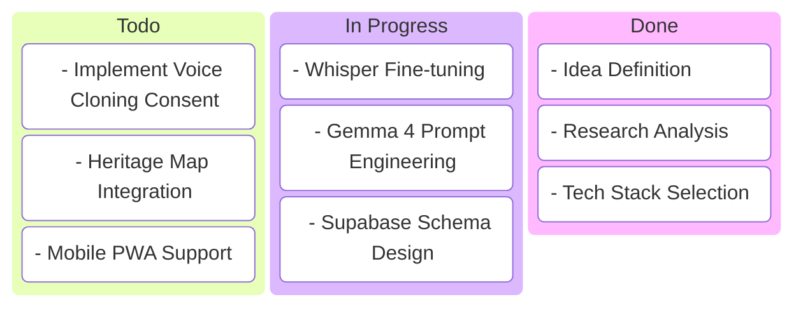

# Product Requirements Document (PRD) — LokKatha AI

## 1. Product Vision
To prevent the permanent loss of India's oral heritage by providing a tool that not only archives speech but understands and cross-references cultural context across languages.

## 2. Target Audience
- **Field Volunteers/NGOs:** Recording elders in rural areas.
- **Historians/Researchers:** Analyzing cultural patterns.
- **General Public:** Discovering their roots and traditional knowledge.

## 3. Functional Requirements
| ID | Feature | Description | Priority |
|----|---------|-------------|----------|
| FR1 | Audio Processing | Convert regional Indian dialects to text using Whisper | High |
| FR2 | AI Transformation | Summarize, translate (EN, HI, BN), and tag transcripts using Gemma 4 | High |
| FR3 | Semantic Search | Search for "Ancient irrigation" and find relevant stories regardless of language | High |
| FR4 | Interactive Q&A | Chat with the archive using RAG to get factual answers with citations | Medium |
| FR5 | Consent Mgmt | Digital signing and storage of informed consent forms | Critical |
| FR6 | Offline Mode | Ability to record and queue uploads for low-connectivity areas | Medium |

## 4. Non-Functional Requirements
- **Accuracy:** ASR Word Error Rate (WER) optimized for Indic languages.
- **Latency:** RAG responses under 3 seconds.
- **Ethical:** Strict adherence to indigenous data sovereignty.
- **Scalability:** Support for millions of archival segments.

## 5. User Flow (Advanced FlowChart)

## 6. Project Kanban

