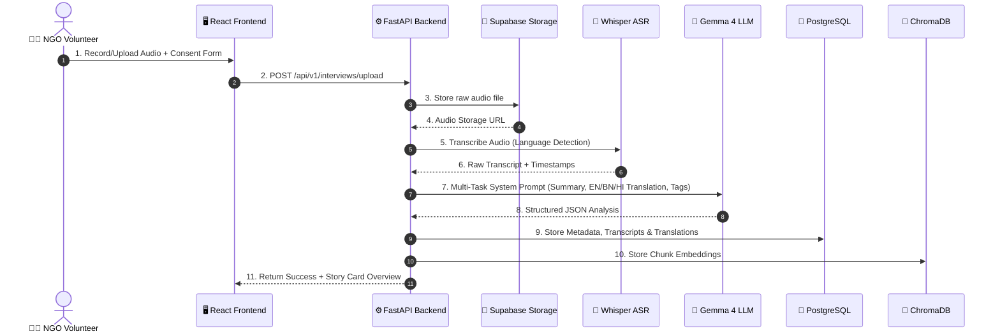

# 📘 LokKatha AI — Complete Technical & Product Master Specification

> **Project Name:** LokKatha AI – India's Living Cultural Memory  
> **Hackathon Theme:** GenAI for Good (Google Build with Gemma)  
> **Primary AI Model:** Google Gemma 4  
> **Document Status:** Complete Architectural & Product Specification  

---

## 📑 Table of Contents
1. [Problem Statement & Domain Analysis](#1-problem-statement--domain-analysis)
2. [Current Problems & Existing Solutions](#2-current-problems--existing-solutions)
3. [Why Existing Solutions Fail](#3-why-existing-solutions-fail)
4. [Our Solution: LokKatha AI](#4-our-solution-lokkatha-ai)
5. [Future Vision & Strategic Impact](#5-future-vision--strategic-impact)
6. [Innovation, Scalability & Social Impact](#6-innovation-scalability--social-impact)
7. [UN Sustainable Development Goals (SDGs)](#7-un-sustainable-development-goals-sdgs)
8. [Target Audience & Expected Users](#8-target-audience--expected-users)
9. [Technical Architecture & Data Flow](#9-technical-architecture--data-flow)
10. [Folder Structure](#10-folder-structure)
11. [Complete API Specification](#11-complete-api-specification)
12. [Database Design & Schema (PostgreSQL + ChromaDB)](#12-database-design--schema-postgresql--chromadb)
13. [Gemma 4 Prompt Engineering Design](#13-gemma-4-prompt-engineering-design)
14. [AI Processing Workflow](#14-ai-processing-workflow)
15. [RAG Pipeline Architecture](#15-rag-pipeline-architecture)
16. [Deployment Strategy](#16-deployment-strategy)
17. [Future Improvements](#17-future-improvements)
18. [Challenges & Technical Limitations](#18-challenges--technical-limitations)

---

## 1. Problem Statement & Domain Analysis

India is home to **1.4 billion citizens**, **22 constitutionally recognized languages**, over **1,600 dialects**, and thousands of unwritten indigenous traditions. A massive portion of Indian wisdom—ranging from **Traditional Ecological Knowledge (TEK)** (monsoon management, organic pest control, soil rejuvenation) to **oral folklore, tribal songs, artisan craft techniques, and regional history**—exists exclusively in the minds of community elders.

Every day, thousands of elders pass away. When an elder dies in a rural village without their oral accounts being recorded, **centuries of accumulated local wisdom vanish permanently**. 

### Key Dimensions of the Problem:
- **Linguistic Extinction:** Dialects like Kurux, Toda, Nihali, and regional variants of Bengali and Hindi are rapidly losing fluent speakers.
- **Generational Disconnect:** Urban migration and digital distraction have severed traditional intergenerational storytelling loops.
- **Absence of Written Records:** Rural artisans, folk singers, and farmers never wrote down their knowledge due to low literacy rates or purely oral tradition norms.

---

## 2. Current Problems & Existing Solutions

### Current Ecosystem:
1. **Government Archives (e.g., IGNCA / NCAA):** Centralized audiovisual archives containing static recordings of performing arts and ethnography.
2. **Academic Fieldwork:** Individual anthropologists capturing voice memos on tape or digital recorders stored on isolated hard drives.
3. **General Social Media / YouTube:** Amateurs uploading random videos without transcriptions, searchable tags, or multi-lingual indexing.

---

## 3. Why Existing Solutions Fail

| Existing Approach | Primary Failure Point | Why It Cannot Scale |
| :--- | :--- | :--- |
| **State Archives (IGNCA/NCAA)** | Heavy bureaucracy, non-interactive, no AI search | Closed repositories; citizens cannot ask natural language questions or query cross-lingually. |
| **Academic Repositories** | Siloed on personal drives, unstructured raw audio | Unindexed raw audio files require hours of manual listening; no speech-to-text or translation. |
| **YouTube / Video Blogs** | Optimized for virality, not preservation | High-traffic commercial content dominates; regional elder dialects get zero algorithmic reach and no transcript searchability. |
| **Generic AI Chatbots (ChatGPT / Standard RAG)** | Hallucinate on regional Indian nuances, struggle with Indic scripts | Lack specialized prompts for honorifics, regional terminology, and cultural context preservation. |

---

## 4. Our Solution: LokKatha AI

**LokKatha AI** is an end-to-end, multilingual AI cultural preservation platform that converts raw field interviews into an interactive, structured, searchable, and conversational cultural memory bank.

```
[ Field Audio Recording ] ──► [ Whisper ASR (Indic) ] ──► [ Gemma 4 Multi-Task LLM ]
                                                                     │
                                          ┌──────────────────────────┼──────────────────────────┐
                                          ▼                          ▼                          ▼
                                [ Multilingual Trans ]     [ Cultural Tags & TEK ]     [ Dense Embeddings ]
                                (EN, BN, HI)                (Farming, Craft, Songs)     (ChromaDB Vector Store)
                                                                                                │
                                                                                                ▼
                                                                                   [ Interactive RAG Q&A ]
```

### Core Pipeline Capabilities:
1. **Audio Ingestion & Noise Preprocessing:** Accepts field voice recordings (.wav, .mp3, .m4a) and applies noise reduction.
2. **ASR (Speech-to-Text):** Uses OpenAI Whisper tuned with Indic language prompts.
3. **Gemma 4 Multi-Task Intelligence:**
   - Summarizes long oral histories into concise narrative arcs.
   - Translates into **English, Bengali, and Hindi**, preserving cultural metaphors.
   - Extracts cultural tags and identifies Traditional Ecological Knowledge (TEK).
   - Generates historical significance notes and context.
4. **Vectorization & Hybrid RAG:** Stores transcript chunks in ChromaDB to enable conversational Q&A where users can ask questions in any language and receive grounded answers backed by direct audio timestamp citations.

---

## 5. Future Vision & Strategic Impact

LokKatha AI aims to become **India's National Living Memory Engine**—a public digital infrastructure for cultural preservation. 

- **Phase 1 (Hackathon MVP):** Record field interviews, process via Whisper + Gemma 4, translate EN/BN/HI, store in ChromaDB/PostgreSQL, serve RAG Q&A.
- **Phase 2 (Community & NGO Scaling):** Offline-first mobile PWA for field volunteers in low-connectivity rural zones.
- **Phase 3 (Heritage Map & Education):** Interactive GIS map of India showing regional stories, integrated into school curricula to reconnect children with local roots.

---

## 6. Innovation, Scalability & Social Impact

### Innovation Highlights:
- **Gemma 4 Indic Nuance Engine:** Leverages Google Gemma 4's superior Indic script tokenization and cultural understanding compared to general English-centric LLMs.
- **Cross-Lingual Cultural RAG:** Ask a query in English (*"How were drought-resistant seeds preserved in Purulia?"*) and search across Bengali oral transcripts to synthesize an answer.
- **Attributed Heritage Intelligence:** Every answer generated by LokKatha AI cites the original narrator's name, village, recording date, and exact audio timestamp.

### Scalability Architecture:
- **Asynchronous Processing:** FastAPI + Celery worker queue isolates slow audio transcription from frontend responsiveness.
- **Vector DB Partitioning:** ChromaDB collections grouped by state and language for sub-100ms vector search queries.

---

## 7. UN Sustainable Development Goals (SDGs)

```
   ┌──────────────────────┐      ┌──────────────────────┐      ┌──────────────────────┐
   │    SDG TARGET 11.4   │      │    SDG TARGET 4.7    │      │    SDG TARGET 10.2   │
   │  Safeguard Cultural  │      │  Appreciation of     │      │  Empower & Include   │
   │   & Natural Heritage │      │  Cultural Diversity  │      │   Rural Elders       │
   └──────────────────────┘      └──────────────────────┘      └──────────────────────┘
```

- **SDG 11: Sustainable Cities & Communities (Target 11.4):** Direct digital preservation of tangible and intangible cultural heritage.
- **SDG 4: Quality Education (Target 4.7):** Provides authentic local stories for heritage-based education in schools.
- **SDG 10: Reduced Inequalities (Target 10.2):** Amplifies the voices of non-literate rural elders, tribal artisans, and marginalized folk artists.

---

## 8. Target Audience & Expected Users

1. **NGO Field Workers & Volunteers (30%):** Collect oral interviews during health/education camps.
2. **Rural Storytellers & Elders (25%):** Share life stories, songs, and indigenous techniques.
3. **Academic Researchers & Historians (20%):** Conduct cross-regional studies on folklore and agricultural history.
4. **Educators & School Teachers (15%):** Introduce students to hyper-local history and regional folk tales.
5. **General Citizens & Diaspora (10%):** Reconnect with ancestral roots and forgotten cultural knowledge.

---

## 9. Technical Architecture & Data Flow



---

## 10. Folder Structure

```text
lokkatha-ai/
├── app/
│   ├── __init__.py
│   ├── main.py                 # FastAPI Application Gateway
│   ├── config.py               # Environment Variables & Settings
│   ├── api/                    # API Route Handlers
│   │   ├── v1/
│   │   │   ├── interviews.py   # Upload & Audio Processing Routes
│   │   │   ├── search.py       # Semantic Vector Search Routes
│   │   │   ├── rag.py          # Interactive Q&A Routes
│   │   │   ├── consent.py      # Digital Consent Management
│   │   │   └── analytics.py    # NGO Impact Dashboard Metrics
│   ├── core/                   # Core Business Logic & AI Engines
│   │   ├── whisper_engine.py   # ASR Pipeline & Denoising
│   │   ├── gemma_engine.py     # Gemma 4 LLM Orchestration
│   │   ├── embeddings.py       # Vectorization Service
│   │   └── rag_engine.py       # Context Retrieval & Generation
│   ├── db/                     # Data Persistence Layer
│   │   ├── base.py
│   │   ├── models.py           # SQLAlchemy ORM Models
│   │   └── chromadb_client.py  # ChromaDB Vector Store Client
│   ├── schemas/                # Pydantic Request/Response Models
│   │   ├── interview.py
│   │   ├── search.py
│   │   └── rag.py
│   └── prompts/                # Gemma 4 System Prompts
│       ├── summarizer.txt
│       ├── translator.txt
│       └── tag_extractor.txt
├── docs/                       # Project Documentation
│   ├── README.md
│   ├── PRD.md
│   ├── TRD.md
│   ├── THEORY.md
│   ├── PROJECT_EXPLANATION.md
│   ├── PPT_STRUCTURE.md
│   ├── PITCH_DECK.md
│   ├── DEMO_SCRIPT.md
│   ├── JUDGES_FAQ.md
│   ├── DESIGN_SYSTEM_UIUX.md
│   └── HACKATHON_STRATEGY_PLAYBOOK.md
├── requirements.txt
├── Dockerfile
├── docker-compose.yml
└── README.md
```

---

## 11. Complete API Specification

| Method | Endpoint | Description | Request Body | Response |
| :--- | :--- | :--- | :--- | :--- |
| `POST` | `/api/v1/interviews/upload` | Upload audio & trigger processing | `multipart/form-data` (file, metadata, consent) | `{ interview_id, status, processing_time }` |
| `GET` | `/api/v1/interviews/{id}` | Retrieve interview details & transcripts | None | `{ id, title, summary, translations, tags }` |
| `POST` | `/api/v1/search/semantic` | Perform cross-lingual vector search | `{ query, language, top_k }` | `{ results: [ { id, title, score, snippet } ] }` |
| `POST` | `/api/v1/rag/ask` | Natural language conversational Q&A | `{ question, preferred_language }` | `{ answer, citations: [ { narrator, timestamp } ] }` |
| `GET` | `/api/v1/analytics/dashboard` | NGO Impact & Archive Statistics | None | `{ total_hours, stories_count, languages_breakdown }` |

---

## 12. Database Design & Schema (PostgreSQL + ChromaDB)

### PostgreSQL Entity Relationship Diagram (Conceptual):
- `users` (id, name, email, role, ngo_affinity)
- `narrators` (id, display_name, age_range, village, district, consent_status)
- `interviews` (id, narrator_id, user_id, audio_url, duration_seconds, recorded_at)
- `transcripts` (id, interview_id, raw_transcript, detected_language, confidence_score)
- `translations` (id, transcript_id, language_code [en|bn|hi], translated_text)
- `cultural_tags` (id, transcript_id, tag_name, category)

### ChromaDB Collection Schema:
- **Collection Name:** `lokkatha_story_chunks`
- **Metadata Fields:** `interview_id`, `narrator_name`, `language`, `start_time`, `end_time`, `category`
- **Embedding Dimensions:** 768 (`multilingual-e5-large` / Gemma-native embeddings)

---

## 13. Gemma 4 Prompt Engineering Design

### Master System Prompt for Story Processing:
```text
You are an expert Indian Cultural Historian and Linguist specializing in oral traditions, folklore, and Traditional Ecological Knowledge (TEK).

Input Transcript:
"{RAW_TRANSCRIPT}"

Original Language: {DETECTED_LANGUAGE}
Narrator Context: {NARRATOR_LOCATION}, India

Your Task:
Generate a structured JSON output with the following exact schema:
{
  "title": "A captivating 5-8 word traditional title for this story",
  "summary": "A rich 3-4 sentence narrative summary preserving emotional depth",
  "translations": {
    "english": "Fluent English translation preserving idioms",
    "bengali": "Standard Bengali translation using proper Bengali script",
    "hindi": "Formal Hindi translation using Devanagari script with respect registers"
  },
  "cultural_tags": ["Array of 4-6 tags like TEK, Folk Medicine, Monsoon Wisdom"],
  "historical_significance": "A brief 2-sentence note on why this narrative is historically valuable"
}
```

---

## 14. AI Processing Workflow

1. **Voice Capture:** 16kHz mono audio input.
2. **Whisper ASR:** Generates raw script + sentence-level timestamps.
3. **Gemma 4 Processing:** Asynchronous API execution with JSON mode schema enforcement.
4. **Chunking & Vectorization:** Text broken into 300-word overlapping chunks, embedded via vectorizer, saved to ChromaDB.

---

## 15. RAG Pipeline Architecture

```
User Question ──► Query Vectorizer ──► ChromaDB Similarity Search (Top-5 Chunks)
                                                │
                                                ▼
Gemma 4 RAG Prompt ◄── [ Context Chunks + System Instructions + User Question ]
       │
       ▼
Gemma 4 Synthesis Engine ──► Grounded Answer + Citations (Narrator Name + Timestamp)
```

---

## 16. Deployment Strategy

- **Backend API:** Hosted on **Railway / Render** via Docker container.
- **Database:** Managed **Supabase PostgreSQL** instance with `pgvector` enabled.
- **Vector Store:** **ChromaDB Cloud / Persistent Docker Volume**.
- **Model Inference:** **Google AI Studio API / Hugging Face Inference Endpoints** for Gemma 4.

---

## 17. Future Improvements

1. **Offline Field Edge Nodes:** Deploy Gemma 4 1B/4B locally via Ollama on field laptops for offline recording.
2. **Audio Timeline Visualization:** Interactive visual waveform showing story thematic shifts.
3. **GIS Heritage Map:** Map-based discovery of stories by state, district, and village.

---

## 18. Challenges & Technical Limitations

| Challenge | Impact | Mitigation Strategy |
| :--- | :--- | :--- |
| **Heavy Village Background Noise** | Reduced ASR accuracy | Apply `RNNoise` pre-filter before Whisper execution. |
| **Dialectal Code-Switching (Hinglish/Banglish)** | Transcript confusion | Use Gemma 4 prompt tuning for mixed-language normalization. |
| **API Latency on Long Files** | Slow response time | Process audio in 3-minute async chunks using background workers. |

---
