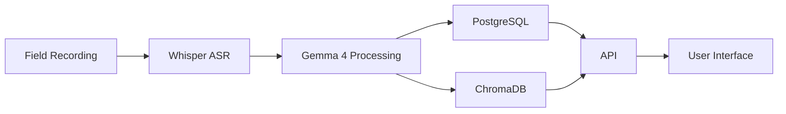
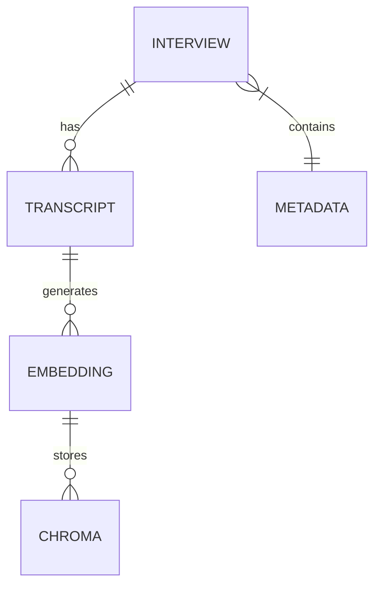
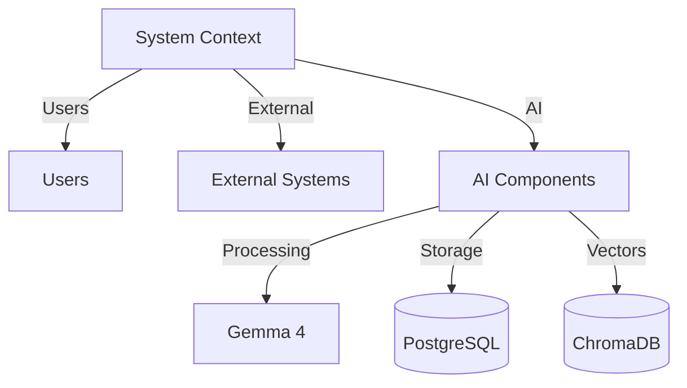
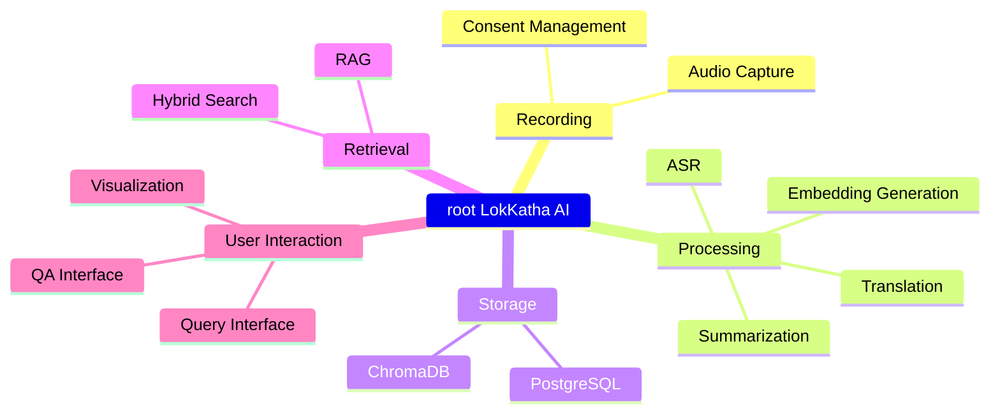

# LokKatha AI

## Project Summary
LokKatha AI is a multilingual platform for preserving India's oral cultural heritage using AI.

## Core Technologies
- Whisper ASR for transcription
- Gemma 4 for translation, summarization, tagging, and embeddings
- PostgreSQL for metadata
- ChromaDB for vector embeddings
- FastAPI backend
- React/Streamlit frontend

## Architecture Overview

## Key Diagrams
- **Entity Relationship Diagram**

- **C4 Diagram (Context)**

- **Mindmap**
