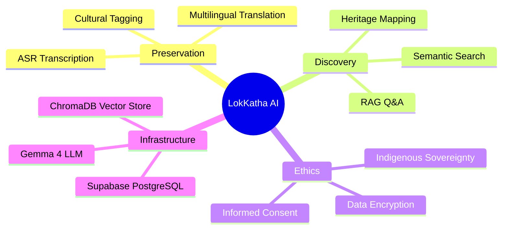

# Theory & Framework — LokKatha AI

## 1. Theoretical Foundation

### Automatic Speech Recognition (ASR)
We use **OpenAI Whisper**, a transformer-based encoder-decoder model. 
- **Theory:** It leverages a large-scale weakly supervised pre-training on 680,000 hours of multilingual and multitask supervised data.
- **Optimization:** For Indic languages, we employ **Prompt-Tuning** (providing the model with language-family context) and **Custom BPE Tokenization** to reduce Word Error Rate (WER).

### Large Language Models (LLM) - Gemma 4
**Gemma 4** serves as the cognitive engine.
- **Zero-Shot Translation:** Using its inherent multilingual capabilities to translate without explicit pairs.
- **Summarization:** Implementing *Abstractive Summarization* to condense oral histories while preserving cultural nuance.

### Retrieval-Augmented Generation (RAG)
RAG solves the "hallucination" problem in LLMs.
- **The Process:** $\text{Query} \rightarrow \text{Embedding} \rightarrow \text{Vector Search} \rightarrow \text{Augmented Prompt} \rightarrow \text{LLM}$.
- **Cross-Lingual Retrieval:** By using models like `multilingual-e5-large`, a query in English can retrieve a transcript in Bengali because they map to the same vector space.

## 2. Supabase Integration Theory
Supabase provides the backend infrastructure. We merge it with AI models as follows:
- **Relational Data:** User profiles, interview metadata, and consent logs are stored in standard PostgreSQL tables.
- **Vector Data:** We utilize `pgvector` (via Supabase) or a sidecar `ChromaDB`.
- **Authentication:** Supabase Auth manages field volunteer access levels.
- **Storage:** Supabase Storage handles the `.wav` and `.mp3` files.

## 3. Technical Stack (Future-Proof)

### Libraries & Packages
| Category | Package | Purpose |
|----------|---------|---------|
| **API** | `fastapi`, `uvicorn` | High-performance async backend |
| **ASR** | `openai-whisper`, `faster-whisper` | Speech-to-text processing |
| **LLM** | `langchain`, `google-generativeai` | LLM orchestration and Gemma 4 API |
| **Vector DB** | `chromadb`, `pgvector` | Storage and retrieval of embeddings |
| **Embeddings**| `sentence-transformers` | Generating `multilingual-e5` vectors |
| **Database** | `supabase-py`, `sqlalchemy` | Database ORM and client |
| **Audio** | `librosa`, `pydub` | Audio preprocessing and denoising |

### Proposed Functions
- `transcribe_audio(file_path)` $\rightarrow$ Returns text + timestamps.
- `analyze_transcript(text)` $\rightarrow$ Returns JSON (Summary, Translation, Tags).
- `generate_embedding(text)` $\rightarrow$ Returns vector.
- `rag_query(user_query)` $\rightarrow$ Returns cited answer.

## 4. Mindmap: System Capabilities

