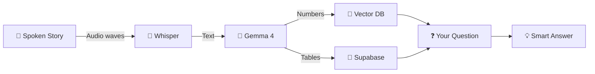
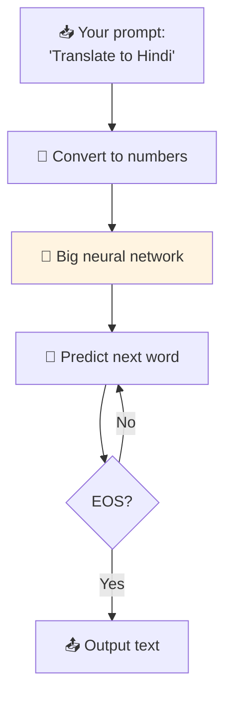
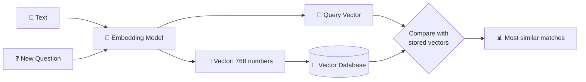
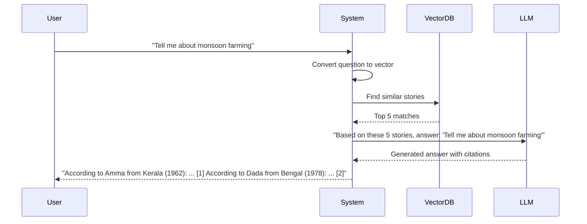
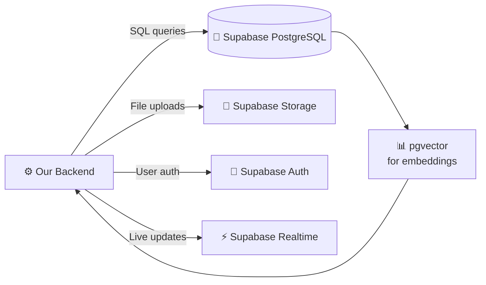
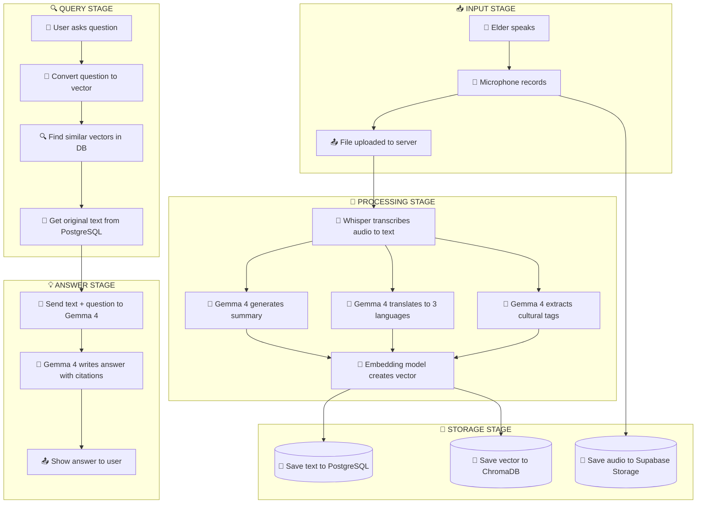
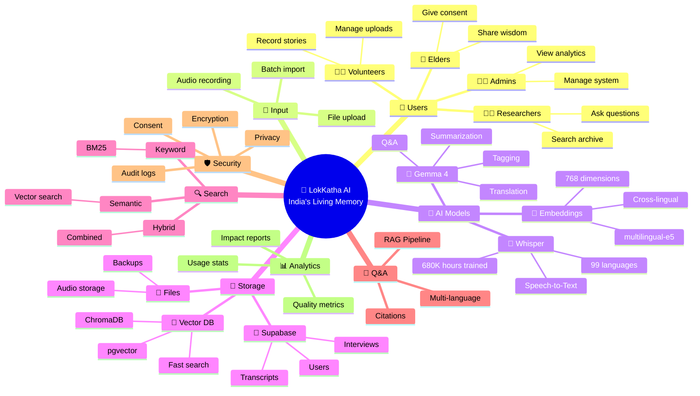
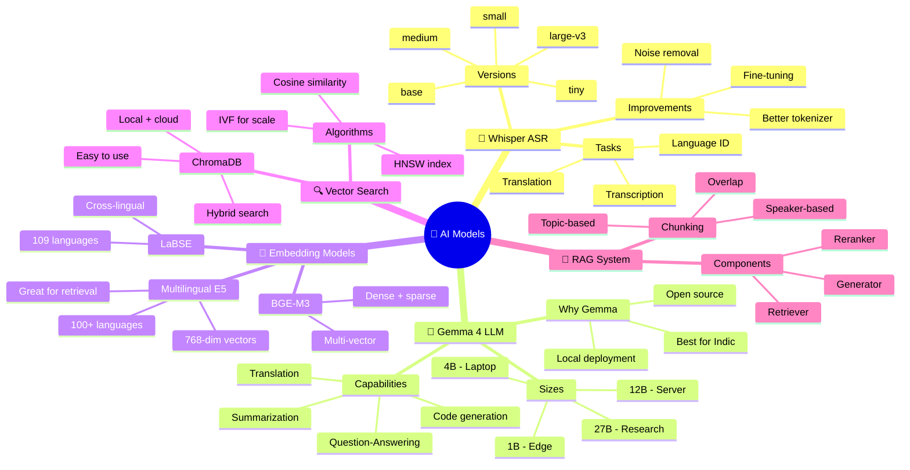

# 📚 Theory & Framework
## LokKatha AI — The Science Behind the Magic

> **Version:** 1.0 (Beginner-Friendly Edition)
> **Date:** July 2026
> **Reading Time:** ~30 minutes

> **A note for the reader:** This document explains the *why* and *how* of all the technology we use. Don't worry if you don't understand everything the first time. Read it slowly, like a story.

---

## 📖 Table of Contents
1. [The Big Picture Theory](#1-the-big-picture-theory)
2. [Theory 1: Automatic Speech Recognition (ASR)](#2-theory-1-automatic-speech-recognition-asr)
3. [Theory 2: Large Language Models (LLMs) and Gemma 4](#3-theory-2-large-language-models-llms-and-gemma-4)
4. [Theory 3: Embeddings and Vector Search](#4-theory-3-embeddings-and-vector-search)
5. [Theory 4: Retrieval-Augmented Generation (RAG)](#5-theory-4-retrieval-augmented-generation-rag)
6. [Theory 5: Supabase Integration](#6-theory-5-supabase-integration)
7. [Theory 6: Combining All Pieces Together](#7-theory-6-combining-all-pieces-together)
8. [Complete List of Libraries & Packages](#8-complete-list-of-libraries--packages)
9. [All Functions to Be Built (API Reference)](#9-all-functions-to-be-built-api-reference)
10. [Mindmap: The System as One Big Idea](#10-mindmap-the-system-as-one-big-idea)
11. [Mindmap: AI Models in Detail](#11-mindmap-ai-models-in-detail)
12. [Mathematical Foundations (Simple Version)](#12-mathematical-foundations-simple-version)
13. [Glossary of Advanced Terms](#13-glossary-of-advanced-terms)
14. [References for Further Reading](#14-references-for-further-reading)

---

## 1. The Big Picture Theory

### The Library Analogy 📚
Imagine the **world's most amazing library**:
- It can **listen** to grandma's stories and write them down (Whisper ASR)
- It can **read** what it wrote and explain it simply (Gemma 4 LLM)
- It can **find** any story instantly, even if you don't know the exact words (Vector Search)
- It can **chat** with you about the stories, like a wise librarian (RAG)
- It can **remember** who said what and when (Supabase)
- It can **work** even without the internet (Offline Mode)

That's LokKatha AI! Let's now learn about each piece.

### The Information Flow


---

## 2. Theory 1: Automatic Speech Recognition (ASR)

### What is ASR? (Simple)
ASR is the technology that **turns sound into text**. When you say "Hello" to Siri and it types "Hello" on the screen, that's ASR working.

### How Whisper Works
Whisper is an AI made by OpenAI. It was trained on **680,000 hours** of audio from the internet. That's like listening non-stop for **77 years**!

Whisper uses a type of AI called a **Transformer**. Here's the simple version:


### Why is ASR Hard for Indian Languages?

Imagine trying to understand someone speaking in a noisy village with:
- 🚜 Tractor sounds
- 👶 Babies crying
- 🌧️ Rain falling
- 🗣️ Mixed Hindi-English (called "Hinglish")
- 🎵 Old words nobody uses anymore

Whisper struggles with these things, but we can help it by:
1. **Fine-tuning**: Training it on more Indian language examples
2. **Better Tokenization**: Helping it understand the alphabet better
3. **Noise Reduction**: Cleaning the audio first

### Whisper Versions
| Version | Size | Speed | Accuracy | Use Case |
|---------|------|-------|----------|----------|
| `tiny` | 39M | ⚡⚡⚡⚡⚡ | ⭐⭐ | Quick drafts |
| `base` | 74M | ⚡⚡⚡⚡ | ⭐⭐⭐ | Basic use |
| `small` | 244M | ⚡⚡⚡ | ⭐⭐⭐⭐ | Good quality |
| `medium` | 769M | ⚡⚡ | ⭐⭐⭐⭐⭐ | **Recommended** |
| `large-v3` | 1550M | ⚡ | ⭐⭐⭐⭐⭐+ | **Best quality** |

### Datasets We Use to Improve Whisper
- **Vistaar** - Indian language training data
- **Common Voice** - Crowdsourced Indian language audio
- **Kathbath** - Noisy Indian speech (great for field recordings!)

---

## 3. Theory 2: Large Language Models (LLMs) and Gemma 4

### What is an LLM? (Simple)
An LLM is a computer program that has read **billions of pages** of text and learned how language works. It can:
- ✍️ Write stories
- 🌐 Translate between languages
- 📝 Summarize long documents
- 💬 Answer questions
- 🏷️ Categorize text

### What is Gemma 4?
Gemma 4 is an LLM made by Google. We chose it because:
- ✅ It's **really good at Indian languages** (better than ChatGPT for Hindi/Bengali!)
- ✅ It's **free and open-source** (Apache 2.0 license)
- ✅ It can run on **small computers** (offline mode!)
- ✅ It can understand **multiple Indian languages** at once

### How LLMs Work (Simple Version)



Think of it like **super-powered autocomplete**. It looks at all the words before and predicts what comes next.

### Gemma 4 Sizes
| Size | RAM Needed | Speed | Quality | Best For |
|------|-----------|-------|---------|----------|
| 1B | 4GB | ⚡⚡⚡⚡⚡ | ⭐⭐⭐ | Offline phones |
| 4B | 8GB | ⚡⚡⚡⚡ | ⭐⭐⭐⭐ | Laptops |
| 12B | 24GB GPU | ⚡⚡⚡ | ⭐⭐⭐⭐⭐ | **Servers (recommended)** |
| 27B | 48GB GPU | ⚡⚡ | ⭐⭐⭐⭐⭐+ | Research |

### Prompt Engineering (How We Talk to Gemma)

A **prompt** is how we ask the AI to do something. Better prompts = better answers.

#### ❌ Bad Prompt
> "Translate this."

#### ✅ Good Prompt
> "You are an expert Hindi translator. Translate the following English text into formal Hindi using Devanagari script. Preserve cultural context. Text: '[the text]'"

#### ✅✅ Great Prompt
> "You are an Indian cultural historian and translator with 20 years of experience. Your task is to translate the following oral history from an elderly Bengali speaker into formal Hindi using Devanagari script. 

> Guidelines:
> 1. Preserve cultural idioms
> 2. Use 'आप' (formal you), not 'तुम' (informal)
> 3. Translate 'lakhs' as 'लाख' and 'crores' as 'करोड़'
> 4. Keep the emotional tone
> 5. Add a short note if something is unclear

> Text: '[the text]'

> Output format: JSON with 'translation' and 'notes' fields."

---

## 4. Theory 3: Embeddings and Vector Search

### The Problem with Keyword Search
Imagine searching for **"ancient farming methods"** in a database of stories. A normal search (called keyword search) would only find stories that have those **exact words**. But what if a story says "old ways of growing rice"? Keyword search would MISS it!

### The Solution: Embeddings
An **embedding** is a way to turn text into a list of numbers that captures its **meaning**. Similar meanings → similar numbers.

#### Example
- "ancient farming" → `[0.2, 0.8, 0.1, ...]`
- "old ways of growing rice" → `[0.21, 0.79, 0.12, ...]` ← **Very close!**
- "modern cars" → `[0.9, 0.1, 0.8, ...]` ← **Very different!**

### How Embeddings Work



### The Magic: Cross-Lingual Search
The best part? Embeddings work **across languages**!

- English: "monsoon farming" → `[0.2, 0.8, ...]`
- Hindi: "बारिश की खेती" → `[0.21, 0.79, ...]`

They're close! So a user can search in English and find Hindi stories! 🎉

### Embedding Models We Use
| Model | Size | Languages | Best For |
|-------|------|-----------|----------|
| `multilingual-e5-large` | 560M | 100+ | **Best for Indian languages** |
| `LaBSE` | 470M | 109 | Cross-lingual similarity |
| `BGE-M3` | 570M | 100+ | Multi-vector search |
| `paraphrase-multilingual` | 280M | 50+ | Lightweight option |

### Vector Databases
We use **ChromaDB** to store and search these number-lists super fast.

| Database | Open Source | Best For |
|----------|-------------|----------|
| **ChromaDB** | ✅ | **Small to medium projects** |
| Pinecone | ❌ Paid | Enterprise scale |
| FAISS | ✅ | Research only |
| Weaviate | ✅ | Hybrid search |
| Qdrant | ✅ | Fast filtering |

---

## 5. Theory 4: Retrieval-Augmented Generation (RAG)

### The Problem with LLMs
LLMs can **make up information** (called "hallucinating"). If you ask "What did grandma say about partition?" the LLM might invent an answer that sounds real but is false!

### The Solution: RAG
**RAG** = **R**etrieval-**A**ugmented **G**eneration

Instead of letting the LLM guess, we:
1. **Search** our database for real stories
2. **Give** those real stories to the LLM
3. **Ask** the LLM to write an answer based on those real stories

It's like an open-book exam vs. a closed-book exam!

### RAG in Action



### RAG Variants
1. **Simple RAG**: Search → Generate ✅ (We start here)
2. **Hybrid RAG**: Combines vector + keyword search
3. **Multi-step RAG**: Asks follow-up questions
4. **Agentic RAG**: AI decides when to search

### Chunking Strategy
We don't search the whole story at once. We split it into **chunks** (small pieces, like cutting a cake into slices).

| Method | Description | Best For |
|--------|-------------|----------|
| **Fixed size** | Every chunk is 500 words | Simple cases |
| **Sentence-based** | Each chunk is 5-10 sentences | Stories |
| **Topic-based** | Split when topic changes | **Oral histories** ✅ |
| **Speaker-based** | Split between speakers | Interviews ✅ |

---

## 6. Theory 5: Supabase Integration

### What is Supabase?
Supabase is like a **Swiss Army knife** for web apps. It gives us:
- 💾 **Database** (PostgreSQL)
- 🔐 **Authentication** (login system)
- 📁 **Storage** (file storage)
- ⚡ **Real-time** (live updates)

It's often called the "open-source Firebase alternative."

### Why We Chose Supabase
- ✅ **Free tier** is generous
- ✅ **PostgreSQL** is super reliable
- ✅ **Built-in auth** saves us time
- ✅ **Row-level security** keeps data safe
- ✅ **Realtime subscriptions** for live updates

### How Supabase Works in Our System



### Database Tables We'll Create

| Table | Purpose | Key Columns |
|-------|---------|-------------|
| `users` | User accounts | id, email, role, name |
| `narrators` | People being recorded | id, name, age, community |
| `interviews` | Recorded sessions | id, user_id, narrator_id, audio_url, date |
| `consents` | Permission records | id, interview_id, signed_at, granted |
| `transcripts` | AI-generated text | id, interview_id, raw_text, summary |
| `translations` | Multi-language versions | id, transcript_id, language, text |
| `tags` | Cultural categories | id, transcript_id, label |
| `embeddings` | Vector representations | id, transcript_id, vector |
| `query_logs` | Analytics | id, user_id, query, response |

### Supabase + pgvector
The best part? We can store vectors **directly in PostgreSQL** using the `pgvector` extension! This means we can use Supabase as our **only database** for both regular data AND vectors.

```sql
-- Example: Create a table with vector column
CREATE TABLE embeddings (
    id UUID PRIMARY KEY DEFAULT uuid_generate_v4(),
    transcript_id UUID REFERENCES transcripts(id),
    embedding vector(768)  -- 768 numbers
);

-- Search for similar vectors
SELECT * FROM embeddings
ORDER BY embedding <-> (SELECT embedding FROM embeddings WHERE id = 'target_id')
LIMIT 5;
```

---

## 7. Theory 6: Combining All Pieces Together

### The Full Picture



### Step-by-Step: What Happens When You Upload Audio

1. **Elder speaks** → Microphone captures sound waves
2. **Audio uploaded** → Sent to our backend server
3. **Whisper transcribes** → Sound waves become text (e.g., Hindi text)
4. **Gemma 4 summarizes** → Long text becomes short summary
5. **Gemma 4 translates** → One text becomes 3 (EN, HI, BN)
6. **Gemma 4 tags** → Identifies themes like "farming", "monsoon"
7. **Embedding model** → Text becomes a 768-number vector
8. **Save to database** → All data goes to PostgreSQL
9. **Save vector** → The number-list goes to ChromaDB
10. **Done!** → User gets a notification

### Step-by-Step: What Happens When You Ask a Question

1. **You ask** → Type a question in any supported language
2. **Convert to vector** → Question becomes a 768-number vector
3. **Search vectors** → Find the 5 most similar vectors in ChromaDB
4. **Get original text** → Look up the full stories in PostgreSQL
5. **Build context** → Combine the 5 stories into a context
6. **Ask Gemma 4** → "Based on these stories, answer: [question]"
7. **Get answer** → Gemma 4 writes a fact-based answer
8. **Show with citations** → User sees the answer + clickable references

---

## 8. Complete List of Libraries & Packages

### Core AI/ML Libraries
| Package | Version | Purpose |
|---------|---------|---------|
| `openai-whisper` | 20240930 | Speech recognition |
| `faster-whisper` | 1.0+ | 4x faster Whisper |
| `transformers` | 4.40+ | Hugging Face models |
| `torch` | 2.0+ | Deep learning framework |
| `sentence-transformers` | 2.7+ | Embedding models |
| `google-generativeai` | latest | Gemma 4 API |
| `langchain` | 0.1+ | LLM orchestration |
| `llama-index` | 0.10+ | Alternative to LangChain |

### Backend & API
| Package | Version | Purpose |
|---------|---------|---------|
| `fastapi` | 0.110+ | Web framework |
| `uvicorn` | 0.27+ | ASGI server |
| `pydantic` | 2.6+ | Data validation |
| `celery` | 5.3+ | Background tasks |
| `redis` | 5.0+ | Cache & queue |
| `python-multipart` | 0.0.9 | File uploads |

### Database & Storage
| Package | Version | Purpose |
|---------|---------|---------|
| `supabase` | 2.4+ | Supabase client |
| `psycopg2-binary` | 2.9+ | PostgreSQL driver |
| `sqlalchemy` | 2.0+ | ORM |
| `alembic` | 1.13+ | Database migrations |
| `pgvector` | 0.2+ | Vector extension |
| `chromadb` | 0.4+ | Vector database |

### Audio Processing
| Package | Version | Purpose |
|---------|---------|---------|
| `librosa` | 0.10+ | Audio analysis |
| `pydub` | 0.25+ | Audio manipulation |
| `soundfile` | 0.12+ | Read/write audio |
| `ffmpeg-python` | 0.2+ | Audio conversion |
| `noisereduce` | 3.0+ | Noise removal |
| `webrtcvad` | 2.0+ | Voice activity detection |

### Frontend (Optional)
| Package | Version | Purpose |
|---------|---------|---------|
| `streamlit` | 1.30+ | Quick prototype UI |
| `gradio` | 4.0+ | ML demo UI |

### Utilities
| Package | Version | Purpose |
|---------|---------|---------|
| `python-dotenv` | 1.0+ | Environment variables |
| `loguru` | 0.7+ | Better logging |
| `tenacity` | 8.2+ | Retry logic |
| `httpx` | 0.27+ | Async HTTP client |
| `pytest` | 8.0+ | Testing |
| `black` | 24+ | Code formatting |

---

## 9. All Functions to Be Built (API Reference)

### `whisper_service.py` Functions

```python
def transcribe_audio(audio_path: str, language: str = None) -> dict:
    """
    Convert audio file to text using Whisper.
    
    Args:
        audio_path: Path to .wav/.mp3 file
        language: Optional language hint ('hi', 'bn', 'en')
    
    Returns:
        dict with keys: 'text', 'segments', 'language', 'confidence'
    """
    pass

def transcribe_long_audio(audio_path: str, chunk_duration: int = 30) -> dict:
    """
    Transcribe long audio (>10 min) by splitting into chunks.
    """
    pass

def detect_language(audio_path: str) -> str:
    """
    Detect the language spoken in the audio.
    """
    pass

def add_timestamps(transcript: str, audio_path: str) -> list:
    """
    Add timestamp info to each sentence.
    """
    pass
```

### `gemma.py` Functions

```python
def summarize_transcript(transcript: str, max_words: int = 200) -> str:
    """
    Generate a short summary of a long transcript.
    """
    pass

def translate_text(text: str, target_lang: str) -> str:
    """
    Translate text to target language ('en', 'hi', 'bn', 'ta', 'te').
    """
    pass

def extract_cultural_tags(transcript: str) -> list:
    """
    Find cultural themes: ['farming', 'festival', 'folktale', ...]
    """
    pass

def extract_keywords(transcript: str, top_n: int = 10) -> list:
    """
    Find the most important words/phrases.
    """
    pass

def generate_questions(transcript: str) -> list:
    """
    Suggest follow-up questions for researchers.
    """
    pass

def historical_context(transcript: str) -> str:
    """
    Add historical context to the story.
    """
    pass
```

### `embeddings.py` Functions

```python
def generate_embedding(text: str, model: str = "multilingual-e5-large") -> list:
    """
    Convert text to a 768-dim vector.
    """
    pass

def batch_embed(texts: list) -> list:
    """
    Generate embeddings for many texts at once (faster).
    """
    pass

def cosine_similarity(vec1: list, vec2: list) -> float:
    """
    Compute how similar two texts are (0.0 to 1.0).
    """
    pass
```

### `database.py` Functions

```python
def create_user(email: str, name: str, role: str) -> User:
    """Create new user account."""
    pass

def save_interview(audio_url: str, narrator_id: str, user_id: str) -> Interview:
    """Save new interview to database."""
    pass

def save_transcript(interview_id: str, text: str, summary: str) -> Transcript:
    """Save transcript and summary."""
    pass

def save_translation(transcript_id: str, language: str, text: str) -> Translation:
    """Save translated version."""
    pass

def save_tag(transcript_id: str, label: str, category: str) -> Tag:
    """Save cultural tag."""
    pass

def get_user_interviews(user_id: str) -> list:
    """Get all interviews for a user."""
    pass
```

### `rag.py` Functions

```python
def semantic_search(query: str, top_k: int = 5, filters: dict = None) -> list:
    """
    Find stories similar to the query.
    Returns: list of (transcript_id, score, snippet)
    """
    pass

def hybrid_search(query: str, top_k: int = 5) -> list:
    """
    Combine vector + keyword search for better results.
    """
    pass

def rag_query(question: str, user_id: str) -> dict:
    """
    Answer a question using RAG.
    Returns: dict with 'answer', 'sources', 'confidence'
    """
    pass

def build_context(chunks: list, max_tokens: int = 3000) -> str:
    """
    Combine retrieved chunks into a context string.
    """
    pass
```

### `interview.py` Functions

```python
def upload_audio(file: UploadFile) -> str:
    """Save audio file and return URL."""
    pass

def validate_audio(file: UploadFile) -> bool:
    """Check if file is valid (size, format)."""
    pass

def preprocess_audio(audio_path: str) -> str:
    """Reduce noise, normalize volume."""
    pass

def get_interview_status(interview_id: str) -> str:
    """Check if processing is done."""
    pass

def delete_interview(interview_id: str) -> bool:
    """Remove interview from all databases."""
    pass
```

### `consent.py` Functions

```python
def record_consent(interview_id: str, audio_consent: bool, 
                   translation_consent: bool) -> Consent:
    """Save consent form."""
    pass

def verify_consent(interview_id: str) -> bool:
    """Check if consent is valid."""
    pass

def revoke_consent(interview_id: str) -> bool:
    """Delete all data related to this interview."""
    pass
```

---

## 10. Mindmap: The System as One Big Idea



---

## 11. Mindmap: AI Models in Detail



---

## 12. Mathematical Foundations (Simple Version)

Don't worry! We explain everything in plain English.

### Cosine Similarity (How we measure if two texts are similar)

Imagine two arrows pointing from the center of a circle:
- If they point the **same way** → very similar (score: 1.0)
- If they point **opposite** → very different (score: -1.0)
- If they're **perpendicular** → unrelated (score: 0.0)

$$\text{similarity} = \cos(\theta) = \frac{\vec{A} \cdot \vec{B}}{|\vec{A}| \times |\vec{B}|}$$

In simple terms: **dot product divided by magnitudes**.

### BLEU Score (How we measure translation quality)
Compares machine translation to human translation. Score 0-1, higher is better.

### WER (Word Error Rate)
How many words the AI got wrong, out of 100.

$$\text{WER} = \frac{\text{substitutions} + \text{deletions} + \text{insertions}}{\text{total words in correct text}}$$

Example: If the correct text is "Hello world" and the AI says "Helo word" → WER = 50% (1 mistake out of 2 words).

---

## 13. Glossary of Advanced Terms

| Term | Simple Explanation |
|------|---------------------|
| **Transformer** | A type of AI architecture that is good at understanding sequences (like sentences) |
| **Neural Network** | A computer program inspired by the human brain that learns from examples |
| **Token** | A piece of text (could be a word, part of a word, or a punctuation mark) |
| **Embedding** | A list of numbers that represents the meaning of text |
| **Vector** | Just a list of numbers (like `[0.5, 0.3, 0.8]`) |
| **Cosine Similarity** | A way to measure how similar two lists of numbers are |
| **Fine-tuning** | Taking a pre-trained AI and training it more on your specific data |
| **Hallucination** | When an AI makes up information that sounds real but is false |
| **RAG** | Retrieval-Augmented Generation - AI that looks things up before answering |
| **pgvector** | A PostgreSQL extension for storing and searching vectors |
| **HNSW** | A super-fast algorithm for finding similar vectors |
| **BLEU Score** | A way to measure how good a translation is |
| **WER** | Word Error Rate - how many mistakes in transcription |
| **In-context Learning** | Teaching an AI by giving examples in the prompt |
| **Zero-shot** | AI doing a task it was never explicitly trained on |
| **Few-shot** | AI doing a task after seeing just a few examples |
| **Prompt Engineering** | The art of writing good instructions for AI |
| **Temperature** | A setting that controls how creative vs. predictable the AI is |

---

## 14. References for Further Reading

### Free Online Courses
- 📺 [FastAPI Tutorial](https://fastapi.tiangolo.com/tutorial/) - Learn our backend
- 📺 [Hugging Face Course](https://huggingface.co/course) - Learn about AI models
- 📺 [Supabase Docs](https://supabase.com/docs) - Learn our database
- 📺 [LangChain Docs](https://python.langchain.com/) - Learn LLM orchestration

### Books
- 📚 "Designing Data-Intensive Applications" by Martin Kleppmann
- 📚 "Speech and Language Processing" by Jurafsky & Martin
- 📚 "Natural Language Processing with Transformers" by Tunstall et al.

### Research Papers
- 📄 Whisper paper: "Robust Speech Recognition via Large-Scale Weak Supervision"
- 📄 Gemma 4 paper: [Google Research Blog]
- 📄 RAG paper: "Retrieval-Augmented Generation for Knowledge-Intensive NLP Tasks"
- 📄 Attention paper: "Attention Is All You Need"

### Community
- 💬 [Hugging Face Discord](https://hf.co/join/discord)
- 💬 [FastAPI Discord](https://discord.gg/fastapi)
- 💬 [Supabase Discord](https://discord.supabase.com)

---

## 🎉 The End (For Now!)

You've reached the end of the theory document! 🎊

You now know:
- ✅ How ASR works (Whisper)
- ✅ How LLMs work (Gemma 4)
- ✅ How vector search works
- ✅ How RAG works
- ✅ How Supabase fits in
- ✅ All the libraries we'll use
- ✅ All the functions we'll build

**The best way to learn is by doing.** So let's start building! 🛠️

---

*Made with ❤️ for curious minds*
