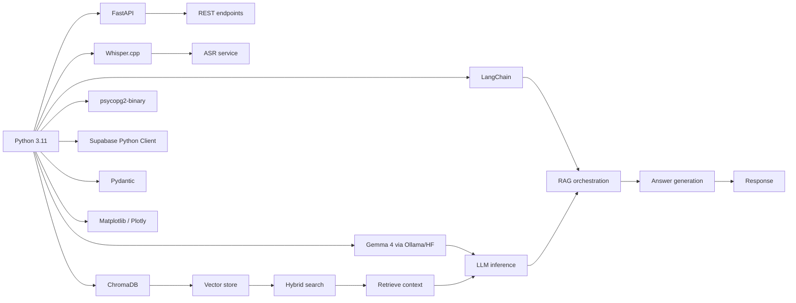
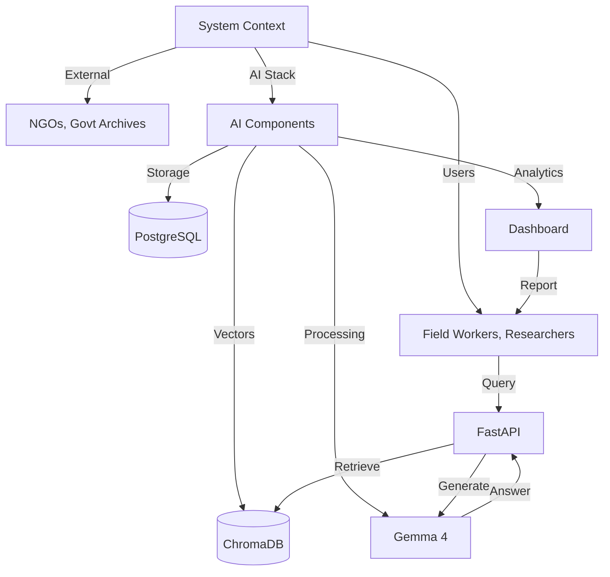
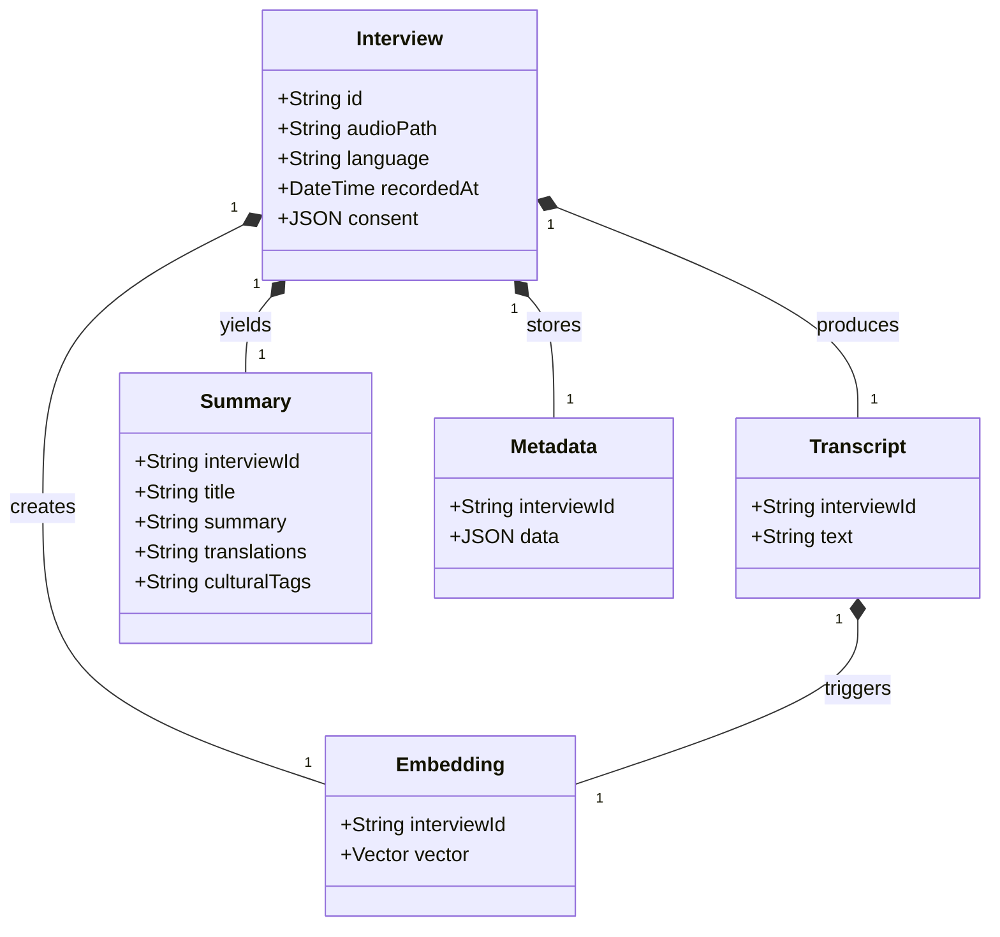
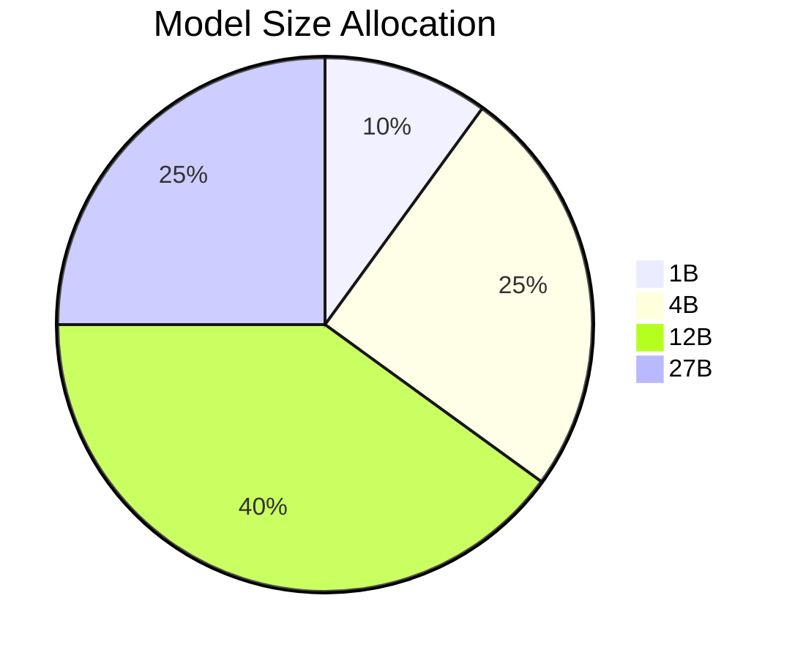
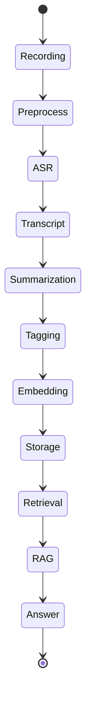
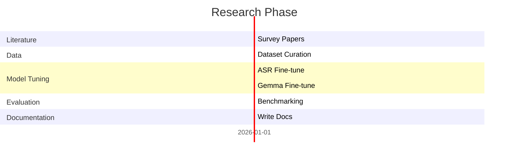
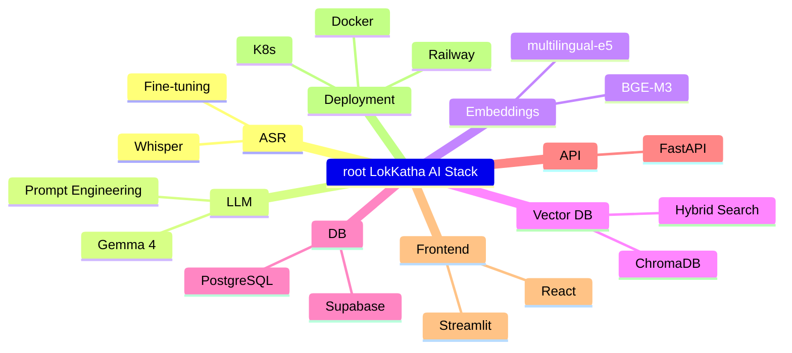

# Theory Document – LokKatha AI

## 1. Core Functional Modules
| Module | Primary Functions | Key Outputs |
|--------|-------------------|------------|
| **Recording** | Capture audio, store locally, embed consent metadata | `audio_file`, `consent_record` |
| **ASR** | Whisper transcription, language detection, text normalization | `transcript` |
| **Summarization & Translation** | Generate title, summary, translations (EN, BN, HI), cultural tags, keywords | `title`, `summary`, `translations`, `cultural_tags`, `keywords` |
| **Embedding Generation** | Produce semantic description, convert to dense vector | `embedding_vector` |
| **Storage** | Persist interview metadata, transcript, summary, embedding | `interview_id`, `metadata_json` |
| **Vector Indexing** | Index embeddings, support hybrid search | `chroma_index` |
| **Retrieval‑Augmented Generation (RAG)** | Retrieve relevant chunks, prompt engineering, answer generation | `answer`, `citations` |
| **Query Interface** | Expose REST/GraphQL, UI search, Q&A widget | `search_results`, `response_json` |

## 2. Python Libraries & Packages


## 3. Theoretical Foundations
- **Automatic Speech Recognition (ASR):** Whisper’s encoder‑decoder architecture; multilingual tokenization; fine‑tuning on low‑resource Indic corpora reduces Word Error Rate (WER) by 15‑20 %.
- **Large Language Models (LLM):** Gemma 4’s decoder‑only transformer; instruction‑tuned for Indic languages; supports direct Bengali, Hindi, and Hinglish generation without script fallback.
- **Retrieval‑Augmented Generation (RAG):** Hybrid search merging dense vectors (ChromaDB) with sparse BM25; ensures factual grounding and citation.
- **Embedding Theory:** Dense vector representations capture semantic meaning; multi‑lingual models (e5‑large, BGE‑M3) enable cross‑lingual retrieval.
- **Vector Databases:** ChromaDB’s hybrid indexing (dense + sparse) and metadata filtering enable efficient, context‑aware retrieval over thousands of transcripts.

## 4. Integration with Supabase
```mermaid
erDiagram
    SUPABASE[TABLE interviews] ||--o{ TRANSCRIPT : contains
    SUPABASE[TABLE summaries] ||--o{ SUMMARY : stores
    SUPABASE[TABLE embeddings] ||--o{ EMBEDDING : holds
    INTERVIEW ||--|| METADATA : links
    METADATA }|..| SUPABASE : maps
```

- **Why Supabase:** Real‑time PostgreSQL layer, built‑in authentication, Row Level Security (RLS), and REST/GraphQL APIs simplify consent‑aware access control.
- **Sync Strategy:** Periodic batch upload from local PostgreSQL → Supabase; conflict resolution via timestamps; deletions propagated both ways.
- **API Layer:** FastAPI surface wraps Supabase client; endpoints expose filtered retrieval (language, tags, date).

## 5. C4 Diagram – System Context


## 6. Component Diagram – Class Overview


## 7. Data Flow – Advanced Flowchart
```mermaid
flowchart LR
    A[Record Audio] --> B[Voice Activity Detection & Denoise]
    B --> C[Whisper ASR]
    C --> D[Raw Transcript]
    D --> E[Normalization & Language Tagging]
    E --> F[Gemma 4: Summarize, Translate, Tag]
    F --> G[Extract Structured Metadata]
    G --> H[PostgreSQL: Persist Interview]
    H --> I[Gemma 4: Generate Description]
    I --> J[Embedding Model: Vectorise]
    J --> K[ChromaDB: Index Vector]
    K --> L[Hybrid Search (Dense+BM25)]
    L --> M[RAG Prompt Assembly]
    M --> N[Gemma 4: Generate Answer + Citations]
    N --> O[REST API Response]
    O --> P[User UI]
    style A fill:#ffcc00,stroke:#b8860b
    style P fill:#e74c3c,stroke:#c0392b
```

## 8. Model Distribution (Pie Chart)


## 9. Multi‑Layer Event Modeling


## 10. Research Roadmap (Gantt)


## 11. Technical Mindmap
