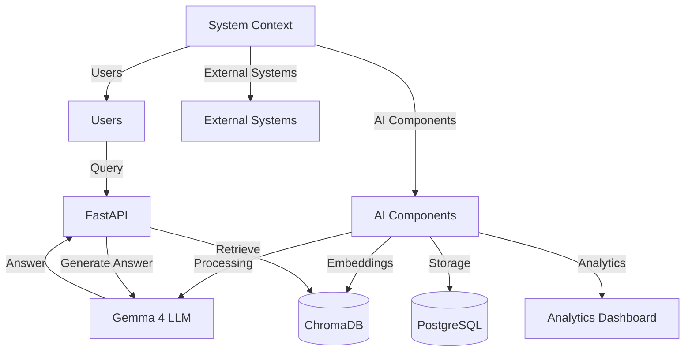
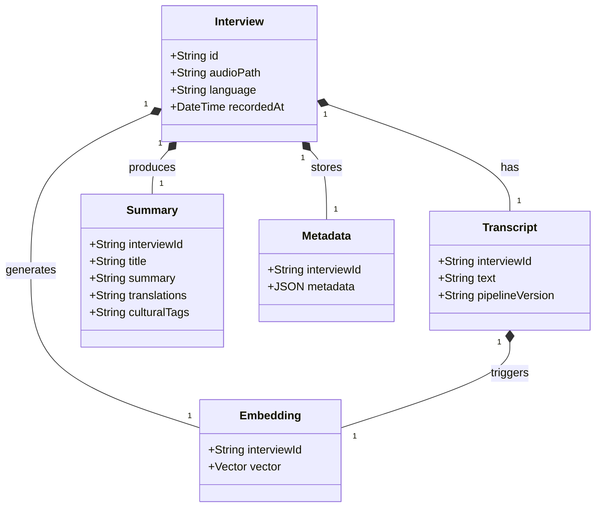
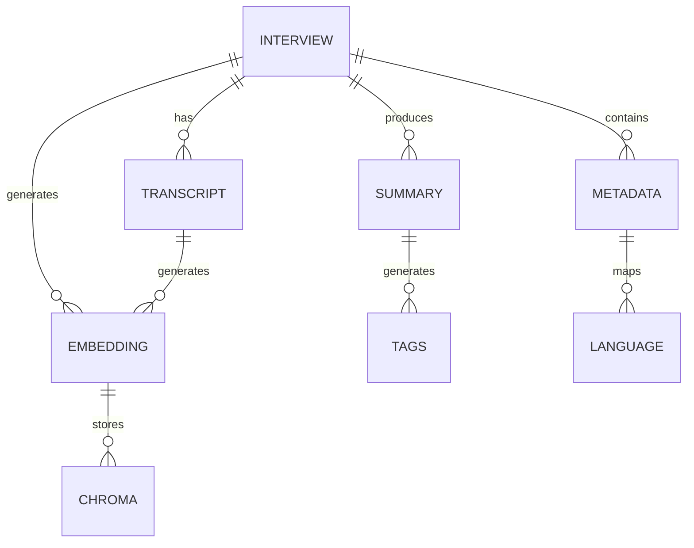
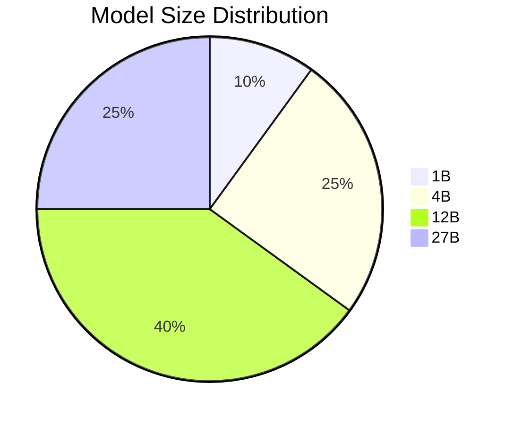
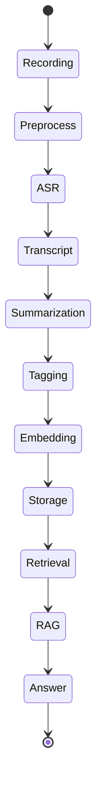
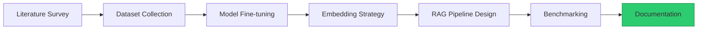
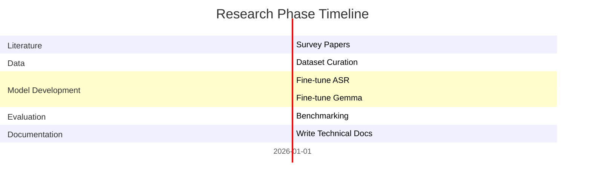
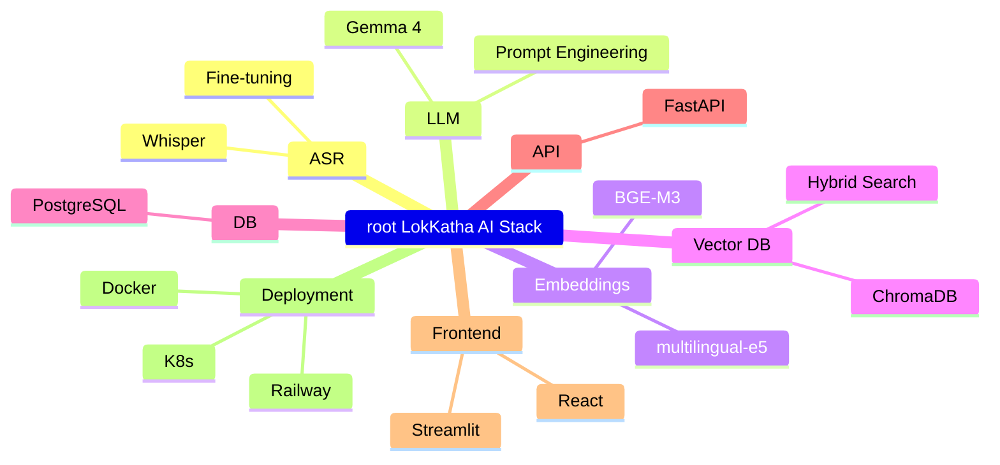

# Technical Research Document (TRD) – LokKatha AI

## 1. Overview
This document details the technical research, architecture, and implementation plan for LokKatha AI, focusing on ASR, multilingual LLM pipelines, vector databases, and retrieval‑augmented generation.

## 2. High‑Level Architecture (C4 Diagram)


## 3. Component Diagram (Class Diagram)


## 4. Entity‑Relationship Diagram


## 5. Data Flow – Large Advanced Flowchart
```mermaid
flowchart LR
    A[Field Recording] --> B[Audio Pre‑processing (VAD, Denoise)]
    B --> C[Whisper ASR]
    C --> D[Raw Transcript]
    D --> E[Cleaning & Normalization]
    E --> F[Gemma 4: Title, Summary, Translations, Tags]
    F --> G[Metadata Extraction]
    G --> H[PostgreSQL: Store Interview, Transcript, Summary]
    H --> I[Gemma 4: Generate Embedding Description]
    I --> J[Embedding Model: Create Vector]
    J --> K[ChromaDB: Index Vector]
    K --> L[Hybrid Search (Dense + BM25)]
    L --> M[RAG Pipeline: Retrieve + Prompt]
    M --> N[Gemma 4: Generate Answer + Citations]
    N --> O[User Interface]
    style A fill:#ffcc00,stroke:#b8860b
    style O fill:#e74c3c,stroke:#c0392b
```

## 6. Model Performance XY Chart
```mermaid
scatter
    title WER (%) vs Language Coverage
    "Hindi" : 12, 0.95
    "Bengali" : 15, 0.92
    "Tamil" : 18, 0.90
    "Telugu" : 20, 0.88
    "Marathi" : 22, 0.85
    "Gujarati" : 25, 0.84
    "Odia" : 28, 0.80
```

## 7. Performance Distribution (Pie Chart)


## 8. Multi‑Layer Event Modeling


## 9. Research Task Kanban


## 10. Timeline (Gantt) – Research Phase


## 11. Mindmap – Technical Stack
