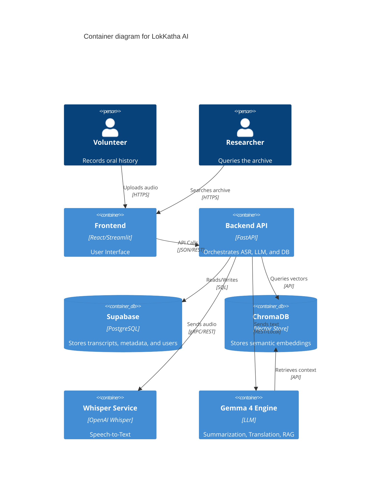
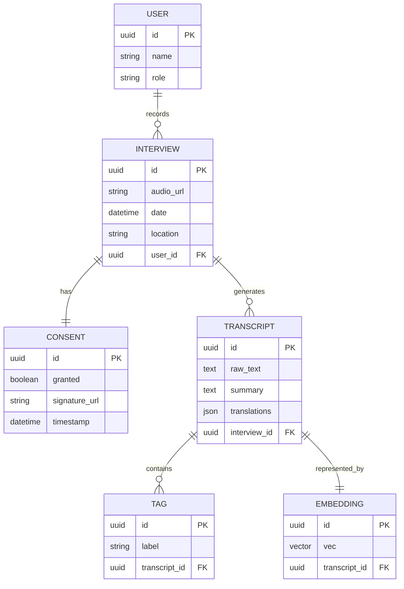
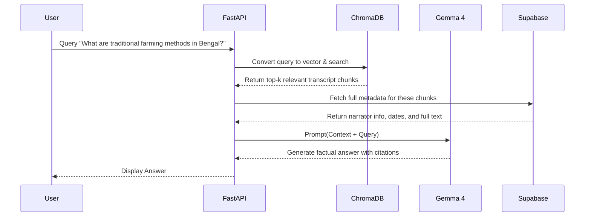

# Technical Requirements Document (TRD) — LokKatha AI

## 1. System Architecture (C4 Model - Level 2)


## 2. Data Model (Entity Relationship Diagram)


## 3. Sequence Diagram (RAG Query Flow)


## 4. Block Diagram (Processing Pipeline)
```mermaid
block-beta
    columns 4
    Audio[Audio Input] --> ASR[Whisper ASR]
    ASR --> LLM[Gemma 4]
    LLM --> DB[(Postgres)]
    LLM --> VDB[(Vector DB)]
    VDB --> RAG[RAG Engine]
    DB --> RAG
    RAG --> Out[Final Answer]
```
