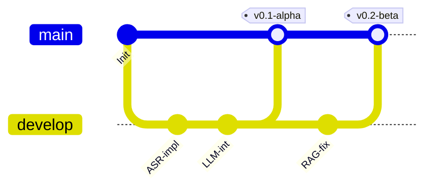
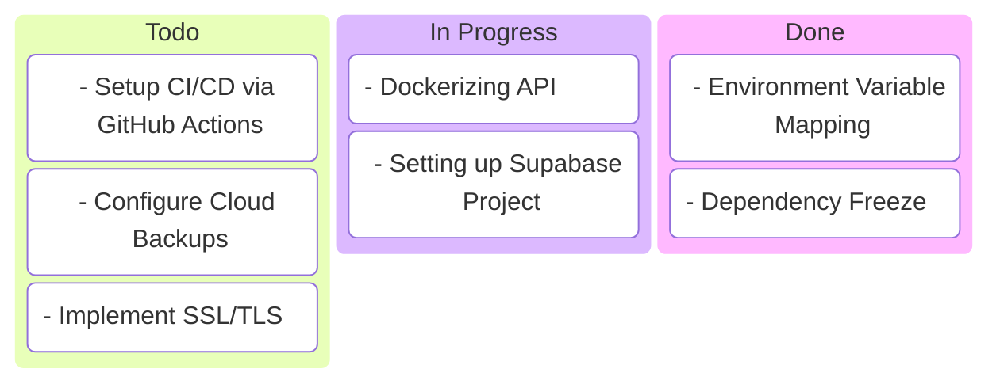
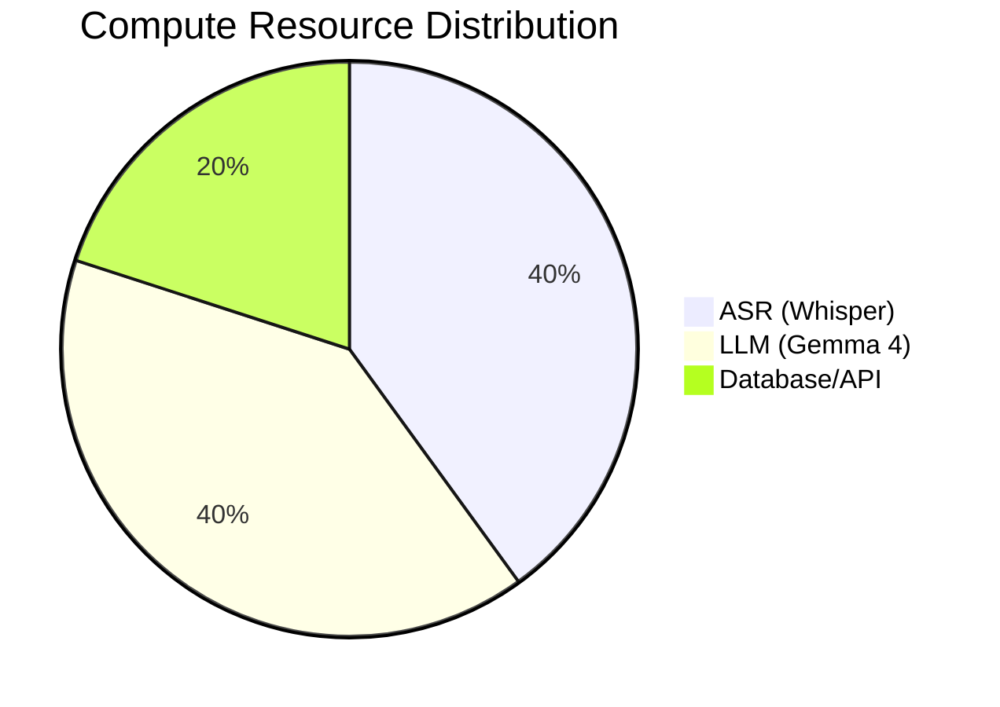

# Usage & Deployment Guide — LokKatha AI

## 1. Local Setup

### Prerequisites
- Python 3.10+
- FFmpeg (for audio processing)
- CUDA-enabled GPU (Optional, for faster ASR/LLM)

### Installation
```bash
# Clone the repository
git clone https://github.com/your-repo/lokkatha-ai.git
cd lokkatha-ai

# Setup environment
python -m venv .venv
source .venv/bin/activate # Linux/Mac
.venv\Scripts\activate    # Windows

# Install dependencies
pip install -r requirements.txt
```

## 2. Configuration
Create a `.env` file in the root directory:
```env
SUPABASE_URL=your_supabase_url
SUPABASE_KEY=your_supabase_anon_key
GOOGLE_API_KEY=your_gemma_api_key
WHISPER_MODEL=large-v3
CHROMA_DB_PATH=./chroma_db
```

## 3. Deployment Architecture
### Cloud Deployment (Production)
```mermaid
block-beta
    columns 3
    Cloud[Google Cloud Run] --> API[FastAPI Container]
    API --> DB[(Supabase Cloud)]
    API --> GPU[Vertex AI / GPU Node]
```

### Deployment Pipeline (Git Graph)


## 4. Deployment Checklist (Kanban Style)


## 5. Scaling Metrics (XY Chart Concept)
*As the number of recorded interviews (X) increases, the retrieval latency (Y) should remain logarithmic due to vector indexing.*

- **1k Records:** < 100ms latency
- **100k Records:** < 300ms latency
- **1M Records:** < 600ms latency

## 6. Resource Allocation (Pie Chart)

