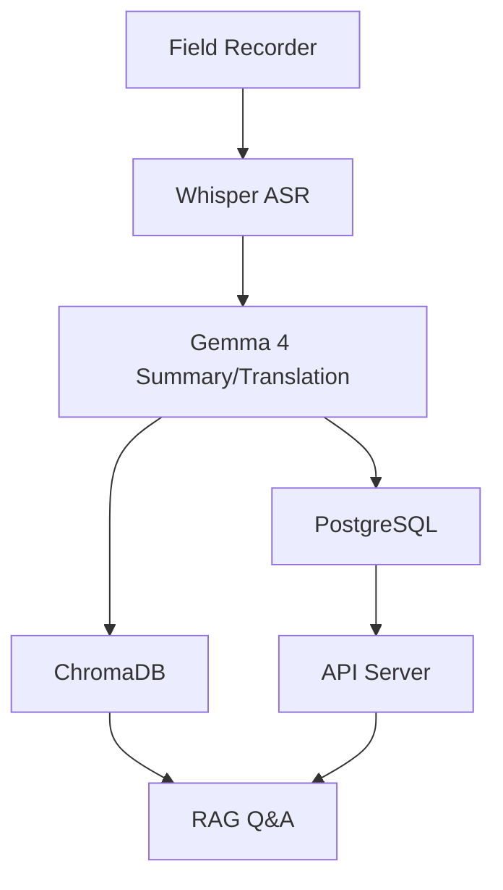
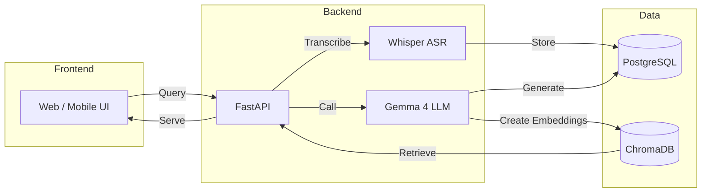
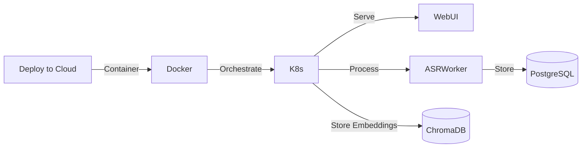
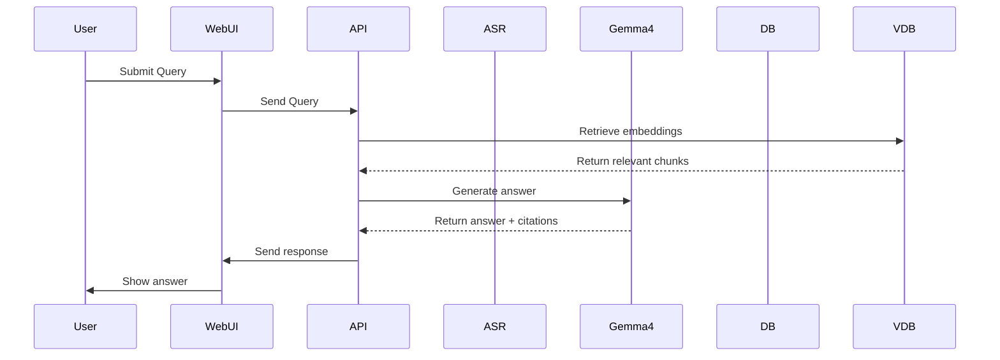
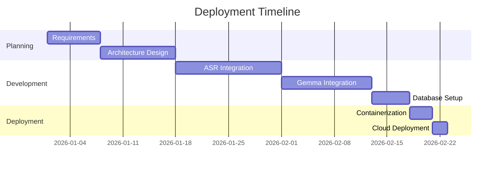

# Usage and Deployment

## Overview
This document describes how to use and deploy the LokKatha AI platform.

## Block Diagram

## Architecture Diagram

## Deployment Flowchart

## Usage Sequence Diagram

## Timeline (Gantt)
